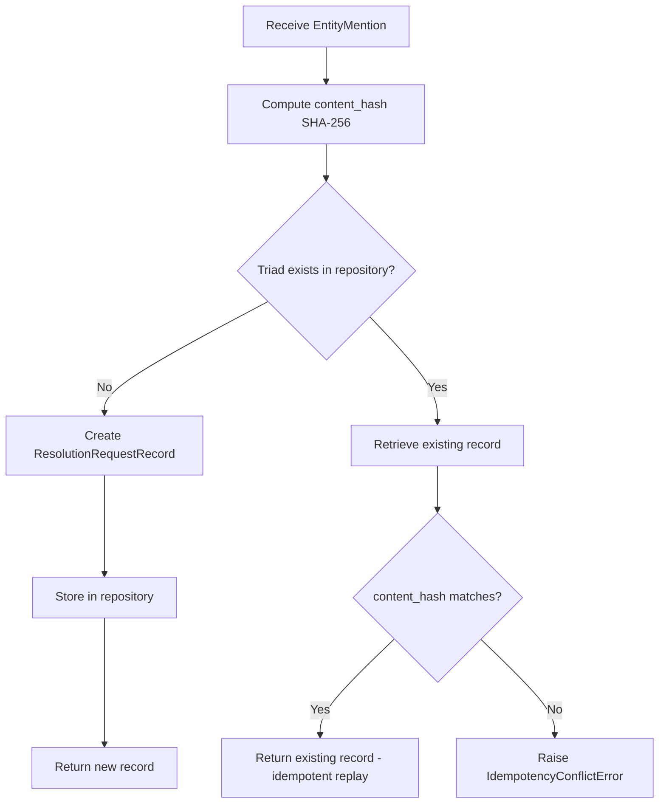

# Epic: ERS-EPIC-01 — Request Registry

## Status
- Phase: Gherkin features complete, ready for implementation
- Last updated: 2026-03-16

## Metadata
| Field | Value |
|-------|-------|
| Epic ID | ERS-EPIC-01 |
| Component | #1 — Request Registry |
| Spines | A (intake), B (engine outcomes), C (bulk sync), D (curation) |
| Dependencies | `er-spec` library (shared domain models) |
| Downstream dependents | All other EPICs (Decision Store, Resolution Coordinator, Bulk Lookup, Curation, Statistics) |

---
# Part 1 — Specification

## 1. Business Context

The Request Registry is the foundational persistence layer of the Entity Resolution System (ERS). It implements the **System of Request Records** described in the conceptual information architecture (Section 9.1-9.2 of the ERS Architecture).

Its purpose is threefold:

1. **Immutable intake record** — Store every accepted Entity Mention and its correlation triad `(sourceId, requestId, entityType)` as an append-only, immutable record. Once accepted, a mention is never modified, merged, versioned, or deleted.
2. **Idempotency enforcement** — Use the triad as the sole uniqueness constraint. Replay of an identical triad returns the existing record. Reuse of a triad with different payload content is rejected as an idempotency conflict.
3. **Lookup state tracking** — Maintain per-sourceId watermark records (`LookupState`) that track when the last bulk lookup was requested from each source, enabling delta exposure semantics for UC-W3 (refreshBulk).

**Implementation Implication:** This component is the first to be built. Every other ERS component depends on the Request Registry for intake validation, triad-based correlation, and lookup state management.

---

## 2. Scope

### In scope

- Pydantic models for: `ResolutionRequestRecord`, `LookupRequestRecord`, `LookupState`, `JSONRepresentation`
- MongoDB repository (adapter) for persisting and querying these models
- Service layer for storing, retrieving, and querying request records and lookup state
- Idempotency enforcement at the service level (triad uniqueness check)
- Import and reuse of `er-spec` domain models (`EntityMentionIdentifier`, `EntityMention`, `CanonicalEntityIdentifier`, `ClusterReference`)
- Registration of lookup requests (per sourceId tracking)
- OpenTelemetry instrumentation at the service layer

### Out of scope

- Bulk request decomposition (EPIC-06: Resolution Coordinator)
- Resolution logic, provisional identifier issuance (EPIC-06)
- Decision Store persistence (EPIC-02 or dedicated Decision Store EPIC)
- REST API / entrypoints (separate EPIC)
- JSON parsing of entity mention content (EPIC-02: content parsing)
- User Action Log (Curation EPIC)
- Authentication / authorisation

---

## 3. Glossary

| Term | Definition |
|------|-----------|
| **Triad** | The composite key `(source_id, request_id, entity_type)` from `EntityMentionIdentifier`. Sole correlation and uniqueness key for Entity Mentions in ERS. |
| **Resolution Request Record** | An ERS-local record wrapping an `EntityMention` (from er-spec) with intake metadata (timestamps, status). Immutable once stored. |
| **Lookup Request Record** | A record capturing that a lookup was requested for a specific `sourceId`, with timestamp. Used for audit and state tracking. |
| **LookupState** | Per-sourceId watermark tracking when the last bulk lookup was successfully produced. Maps to `lastSnapshot` / `lastNotificationDate` in the architecture. |
| **JSONRepresentation** | A thin Pydantic wrapper around `dict[str, Any]` representing a parsed form of entity mention content. Defined here as a model; parsing logic belongs to EPIC-02. |
| **Idempotency conflict** | Reuse of an existing triad with different payload content. Rejected with an explicit error. |
| **Idempotent replay** | Reuse of an existing triad with identical payload content. Returns the existing record without side effects. |
| **er-spec** | External shared library providing domain models (`EntityMention`, `EntityMentionIdentifier`, etc.) used across ERS and ERE. |

---

## 4. Domain Model

### 4.1 Models imported from er-spec

These models are imported, not redefined. The er-spec library is the single source of truth.

| Model | Key fields | Notes |
|-------|-----------|-------|
| `EntityMentionIdentifier` | `source_id: str`, `request_id: str`, `entity_type: str` | The triad. Immutable value object. |
| `EntityMention` | `identifier: EntityMentionIdentifier`, `content: str`, `content_type: str` | Immutable intake artefact. |
| `CanonicalEntityIdentifier` | `identifier: str` | Canonical cluster ID produced by ERE. Not used directly in this EPIC but referenced. |
| `ClusterReference` | `cluster_id: str`, `confidence_score: float`, `similarity_score: float` | Not used directly in this EPIC. |

### 4.2 Models defined in this EPIC

#### JSONRepresentation

```python
class JSONRepresentation(BaseModel):
    """Thin wrapper for a parsed JSON form of entity mention content.
    Parsing logic is NOT in this EPIC — only the model definition."""
    data: dict[str, Any]
```

- Immutable (frozen Pydantic model).
- `data` contains arbitrary key-value pairs produced by a parser (EPIC-02).
- No validation of internal structure in this EPIC.

#### ResolutionRequestRecord

```python
class ResolutionRequestRecord(BaseModel):
    """Immutable intake record for a single entity mention resolution request."""
    identifier: EntityMentionIdentifier          # triad — unique key
    entity_mention: EntityMention                 # full payload as submitted
    json_representation: JSONRepresentation | None = None  # optional parsed form
    received_at: datetime                         # UTC timestamp of acceptance
    content_hash: str                             # SHA-256 of entity_mention.content
```

- Immutable (frozen).
- `content_hash` enables idempotency conflict detection: same triad + different hash = conflict.
- `json_representation` is initially `None`; populated by EPIC-02 parsing.
- `received_at` is set once at creation time, never updated.

#### LookupRequestRecord

```python
class LookupRequestRecord(BaseModel):
    """Record of a lookup request from a specific source."""
    source_id: str                    # which source requested the lookup
    requested_at: datetime            # UTC timestamp of the lookup request
    request_type: LookupRequestType   # enum: SINGLE, BULK
```

#### LookupRequestType

```python
class LookupRequestType(str, Enum):
    SINGLE = "SINGLE"
    BULK = "BULK"
```

#### LookupState

```python
class LookupState(BaseModel):
    """Per-sourceId delta exposure watermark for bulk synchronisation."""
    source_id: str             # unique key
    last_snapshot: datetime    # last point in time for which bulk results were produced
    updated_at: datetime       # when this record was last modified
```

- `last_snapshot` corresponds to `lastNotificationDate` in the architecture.
- Advanced only when a bulk refresh response is successfully produced (not on request receipt).
- `source_id` is the unique key for this collection.

---

## 5. Adapter Specification (MongoDB Repository)

### 5.1 Collections

| Collection | Document root model | Unique index | Additional indexes |
|-----------|-------------------|-------------|-------------------|
| `resolution_requests` | `ResolutionRequestRecord` | `(identifier.source_id, identifier.request_id, identifier.entity_type)` compound unique | `received_at` (ascending), `identifier.source_id` (ascending) |
| `lookup_requests` | `LookupRequestRecord` | None (append-only log) | `(source_id, requested_at)` compound, `requested_at` (ascending) |
| `lookup_states` | `LookupState` | `source_id` unique | None |

### 5.2 Repository Interface

```python
class RequestRegistryRepository(ABC):
    """Abstract repository for Request Registry persistence."""

    # --- Resolution Request Records ---

    @abstractmethod
    async def store_resolution_request(
        self, record: ResolutionRequestRecord
    ) -> ResolutionRequestRecord:
        """Store a new resolution request record.
        Raises DuplicateTriadError if the triad already exists."""

    @abstractmethod
    async def find_by_triad(
        self, identifier: EntityMentionIdentifier
    ) -> ResolutionRequestRecord | None:
        """Retrieve a record by its triad. Returns None if not found."""

    @abstractmethod
    async def find_by_source_id(
        self, source_id: str, limit: int = 100, offset: int = 0
    ) -> list[ResolutionRequestRecord]:
        """Retrieve records for a given source_id, paginated."""

    @abstractmethod
    async def exists_by_triad(
        self, identifier: EntityMentionIdentifier
    ) -> bool:
        """Check if a record with this triad already exists."""

    # --- Lookup Request Records ---

    @abstractmethod
    async def store_lookup_request(
        self, record: LookupRequestRecord
    ) -> LookupRequestRecord:
        """Append a lookup request record."""

    @abstractmethod
    async def find_lookup_requests_by_source(
        self, source_id: str, since: datetime | None = None
    ) -> list[LookupRequestRecord]:
        """Retrieve lookup requests for a source, optionally filtered by time."""

    # --- Lookup State ---

    @abstractmethod
    async def get_lookup_state(
        self, source_id: str
    ) -> LookupState | None:
        """Retrieve the current lookup state for a source_id."""

    @abstractmethod
    async def upsert_lookup_state(
        self, state: LookupState
    ) -> LookupState:
        """Create or update the lookup state for a source_id."""
```

### 5.3 Custom Exceptions (adapter layer)

| Exception | Raised when |
|-----------|------------|
| `DuplicateTriadError` | Attempting to store a `ResolutionRequestRecord` with a triad that already exists in the collection. Wraps MongoDB duplicate key error. |
| `RepositoryConnectionError` | MongoDB connection failure. |
| `RepositoryOperationError` | Generic persistence operation failure (timeouts, write concern errors, etc.). |

---

## 6. Service Specification

### 6.1 Service Interface

```python
class RequestRegistryService:
    """Application service for Request Registry operations."""

    def __init__(self, repository: RequestRegistryRepository): ...

    async def register_resolution_request(
        self,
        entity_mention: EntityMention,
    ) -> ResolutionRequestRecord:
        """Register a new resolution request.

        Algorithm:
        1. Compute content_hash from entity_mention.content (SHA-256).
        2. Check if triad already exists in repository.
           a. If exists AND content_hash matches -> return existing record (idempotent replay).
           b. If exists AND content_hash differs -> raise IdempotencyConflictError.
           c. If not exists -> create ResolutionRequestRecord, store, return.
        3. Set received_at to current UTC time.

        Returns: ResolutionRequestRecord (new or existing).
        Raises: IdempotencyConflictError, RepositoryOperationError.
        """

    async def get_resolution_request(
        self,
        identifier: EntityMentionIdentifier,
    ) -> ResolutionRequestRecord | None:
        """Retrieve a single resolution request by triad."""

    async def list_resolution_requests_by_source(
        self,
        source_id: str,
        limit: int = 100,
        offset: int = 0,
    ) -> list[ResolutionRequestRecord]:
        """List resolution requests for a source, paginated."""

    async def register_lookup_request(
        self,
        source_id: str,
        request_type: LookupRequestType,
    ) -> LookupRequestRecord:
        """Register that a lookup was requested from a source.
        Always succeeds (append-only). Sets requested_at to current UTC."""

    async def get_lookup_state(
        self,
        source_id: str,
    ) -> LookupState | None:
        """Retrieve the current lookup watermark for a source."""

    async def advance_lookup_watermark(
        self,
        source_id: str,
        snapshot_time: datetime,
    ) -> LookupState:
        """Advance the lookup state watermark for a source.
        Called only after a bulk refresh response is successfully produced.
        Sets last_snapshot to snapshot_time, updated_at to current UTC.
        Raises: WatermarkRegressionError if snapshot_time <= current last_snapshot."""
```

### 6.2 Service Exceptions

| Exception | Raised when |
|-----------|------------|
| `IdempotencyConflictError` | Same triad submitted with different content (different `content_hash`). |
| `WatermarkRegressionError` | Attempting to set `last_snapshot` to a time earlier than or equal to the current value. |

### 6.3 Idempotency Algorithm (Mermaid)



### 6.4 Observability

- All service methods instrumented with OpenTelemetry spans.
- Span attributes: `source_id`, `request_id`, `entity_type`, operation name.
- Metrics: counter for `requests_registered`, `idempotent_replays`, `idempotency_conflicts`, `lookup_requests_registered`.
- No logging or tracing inside models or adapters (observability lives at the service layer per architectural constraints).

---

## 7. Anti-Patterns (DO NOT)

| Don't | Do Instead | Why |
|-------|-----------|-----|
| Mutate a `ResolutionRequestRecord` after storage | Treat records as immutable; create new derived artefacts if needed | Immutability is a strict architectural invariant (Section 9.2). Mutation breaks replay, idempotency, and audit. |
| Use a surrogate key (auto-increment ID, UUID) as the primary correlation key | Use the triad `(source_id, request_id, entity_type)` as the sole correlation and uniqueness key | The architecture mandates the triad as the only correlation key. Surrogates create shadow identity. |
| Implement idempotency checks inside the adapter/repository | Implement idempotency logic (hash comparison, conflict detection) in the service layer; the adapter only enforces the unique index | SRP: the adapter handles persistence, the service handles business rules. |
| Store business rules or validation logic inside Pydantic model validators | Keep validation in the service layer; models define structure and constraints only | Models must remain framework-free and testable without I/O. Complex validation is a service concern. |
| Put OpenTelemetry spans or logging inside models or adapters | Instrument only the service layer methods | Observability belongs at the service layer per project architectural constraints. |
| Advance the lookup watermark on request receipt | Advance `last_snapshot` only after a bulk refresh response is successfully produced | Premature advancement breaks delta exposure guarantees (Section 9.2, UC-W3). |
| Compare entity mention content as raw strings for idempotency | Use SHA-256 content hash for comparison | Raw string comparison is fragile (encoding, whitespace). Hashing is deterministic and efficient. |
| Import from `services` or `entrypoints` into `models` or `adapters` | Respect dependency direction: `entrypoints` -> `services` -> `models`, `adapters` -> `models` | Layered architecture invariant. Reversing dependencies creates circular imports and coupling. |

---

## 8. Test Case Specifications

### Unit Tests

| Test ID | Component | Input | Expected Output | Edge Cases |
|---------|-----------|-------|-----------------|------------|
| TC-001 | `ResolutionRequestRecord` model | Valid `EntityMention` with all triad fields | Frozen Pydantic model with correct `content_hash` | Empty `content` string, very long content (>1MB), unicode content |
| TC-002 | `JSONRepresentation` model | `{"key": "value"}` dict | Frozen model with `data` field matching input | Empty dict `{}`, deeply nested dict, `None` values in dict |
| TC-003 | `LookupState` model | Valid `source_id` and datetime values | Model with correct fields | `last_snapshot` at epoch, future timestamps |
| TC-004 | `LookupRequestType` enum | `"SINGLE"`, `"BULK"` | Correct enum members | Invalid string value raises error |
| TC-005 | Service: `register_resolution_request` (new) | New `EntityMention` with unique triad | `ResolutionRequestRecord` stored and returned | First record for a source_id |
| TC-006 | Service: `register_resolution_request` (replay) | Same `EntityMention` submitted twice (identical content) | Returns existing record without creating duplicate | Rapid concurrent replays |
| TC-007 | Service: `register_resolution_request` (conflict) | Same triad, different content | Raises `IdempotencyConflictError` | Content differs only in whitespace (still different hash) |
| TC-008 | Service: `advance_lookup_watermark` (happy) | `source_id` with existing state, `snapshot_time` > current | Updated `LookupState` returned | First watermark for a new source_id |
| TC-009 | Service: `advance_lookup_watermark` (regression) | `snapshot_time` <= current `last_snapshot` | Raises `WatermarkRegressionError` | Equal timestamps (not just less-than) |
| TC-010 | Service: `register_lookup_request` | Valid `source_id` and `LookupRequestType.BULK` | `LookupRequestRecord` stored | Multiple lookups from same source in rapid succession |
| TC-011 | Repository: `store_resolution_request` (duplicate) | Record with existing triad | Raises `DuplicateTriadError` | MongoDB duplicate key error is correctly wrapped |
| TC-012 | Repository: `find_by_triad` (not found) | Non-existent triad | Returns `None` | All three triad fields present but no match |
| TC-013 | Repository: `find_by_source_id` (pagination) | `source_id` with 150 records, `limit=100`, `offset=0` then `offset=100` | First page: 100 records, second page: 50 records | `offset` beyond total count returns empty list |
| TC-014 | Content hash computation | Known content string | Deterministic SHA-256 hex digest | Empty string, binary-like content, identical content in different `EntityMention` instances |

### Integration Tests

| Test ID | Flow | Setup | Verification | Teardown |
|---------|------|-------|--------------|----------|
| IT-001 | Store and retrieve resolution request | Start MongoDB, create indexes | Store record, retrieve by triad, verify all fields match | Drop test collection |
| IT-002 | Idempotency enforcement end-to-end | Store a record via service | Submit same triad+content (replay OK), submit same triad+different content (conflict error) | Drop test collection |
| IT-003 | Lookup state lifecycle | Start MongoDB | Create state, advance watermark, verify `last_snapshot` updated, attempt regression (error) | Drop test collection |
| IT-004 | Unique index enforcement | Create compound unique index on `resolution_requests` | Insert duplicate triad at MongoDB level, verify `DuplicateTriadError` raised | Drop test collection |
| IT-005 | Concurrent request registration | Start MongoDB | Submit 10 identical requests concurrently, verify exactly 1 stored, 9 return existing | Drop test collection |

---

## 9. Error Handling Matrix

| Error Type | Detection | Response | Fallback | Logging Level |
|------------|-----------|----------|----------|---------------|
| Idempotency conflict | SHA-256 hash mismatch on existing triad | Raise `IdempotencyConflictError` with triad details | None — caller must handle | WARN (includes triad, excludes content) |
| Duplicate triad (MongoDB) | `DuplicateKeyError` from pymongo | Adapter wraps as `DuplicateTriadError` | Service catches and runs idempotency check (may be concurrent insert race) | DEBUG |
| MongoDB connection failure | `ConnectionFailure` from pymongo | Adapter wraps as `RepositoryConnectionError` | None — propagate to caller | ERROR |
| MongoDB operation timeout | `ServerSelectionTimeoutError` or `ExecutionTimeout` | Adapter wraps as `RepositoryOperationError` | None — propagate to caller | ERROR |
| Watermark regression | `snapshot_time <= current last_snapshot` | Raise `WatermarkRegressionError` | None — caller must handle | WARN |
| Invalid EntityMention (missing triad fields) | Pydantic validation on `EntityMentionIdentifier` | Pydantic `ValidationError` raised at model construction | None — caller must validate before calling service | Not logged at this layer |
| Empty content string | `entity_mention.content` is empty string | Accept and hash normally (empty string has a valid SHA-256) | None | INFO (flag unusual input) |

---

## 10. Task Breakdown

### Task 1: Define domain models
- **Description:** Create Pydantic models: `JSONRepresentation`, `ResolutionRequestRecord`, `LookupRequestRecord`, `LookupRequestType`, `LookupState`. Verify er-spec imports work.
- **Layers:** `models/`
- **Dependencies:** er-spec library installed
- **Acceptance criteria:** All models instantiate correctly with valid data; frozen models reject mutation; content_hash helper function produces deterministic SHA-256.

### Task 2: Define repository interface and exceptions
- **Description:** Create abstract `RequestRegistryRepository` class and custom exceptions (`DuplicateTriadError`, `RepositoryConnectionError`, `RepositoryOperationError`).
- **Layers:** `adapters/` (interface only)
- **Dependencies:** Task 1 (models)
- **Acceptance criteria:** ABC is importable; exception hierarchy is clean; no concrete implementation yet.

### Task 3: Implement MongoDB repository
- **Description:** Implement `MongoRequestRegistryRepository` with motor (async pymongo). Create indexes on startup. Implement all repository methods.
- **Layers:** `adapters/`
- **Dependencies:** Task 2 (interface), MongoDB available
- **Acceptance criteria:** All repository methods work against a real MongoDB instance; unique index enforced; pagination works; exceptions correctly wrapped.

### Task 4: Implement service layer
- **Description:** Implement `RequestRegistryService` with idempotency algorithm, lookup state management, content hash computation. Add OpenTelemetry instrumentation.
- **Layers:** `services/`
- **Dependencies:** Task 2 (repository interface), Task 1 (models)
- **Acceptance criteria:** Idempotency: new/replay/conflict all handled correctly. Watermark: advance and regression both work. OTel spans emitted. All unit tests pass with mocked repository.

### Task 5: Write integration tests
- **Description:** Integration tests against real MongoDB (via testcontainers or docker-compose). Cover concurrent writes, index enforcement, full lifecycle flows.
- **Layers:** `tests/`
- **Dependencies:** Tasks 1-4
- **Acceptance criteria:** All IT-001 through IT-005 pass. Coverage >= 80% on new code.

## Roadmap

- [ ] Task 1: Define domain models (`models/`)
- [ ] Task 2: Define repository interface and exceptions (`adapters/`)
- [ ] Task 3: Implement MongoDB repository (`adapters/`)
- [ ] Task 4: Implement service layer with idempotency and observability (`services/`)
- [ ] Task 5: Write integration tests (`tests/`)

---

## 11. Gherkin Feature Outline

### Feature: Resolution Request Registration

| Scenario | Description |
|----------|------------|
| Register a new resolution request | Given a valid EntityMention with a unique triad, when the service registers it, then a ResolutionRequestRecord is stored with correct content_hash and received_at. |
| Idempotent replay of identical request | Given an already-registered triad with identical content, when the same request is submitted again, then the existing record is returned without creating a duplicate. |
| Reject idempotency conflict | Given an already-registered triad, when a request with the same triad but different content is submitted, then an IdempotencyConflictError is raised and no record is modified. |
| Register request with empty content | Given a valid EntityMention where content is an empty string, when registered, then a record is stored with the SHA-256 hash of the empty string. |

### Feature: Lookup State Management

| Scenario | Description |
|----------|------------|
| Advance watermark for new source | Given no existing LookupState for a source_id, when advance_lookup_watermark is called, then a new LookupState is created with the given snapshot_time. |
| Advance watermark for existing source | Given an existing LookupState with last_snapshot T1, when advance_lookup_watermark is called with T2 > T1, then last_snapshot is updated to T2. |
| Reject watermark regression | Given an existing LookupState with last_snapshot T1, when advance_lookup_watermark is called with T2 <= T1, then a WatermarkRegressionError is raised and last_snapshot remains T1. |

### Feature: Lookup Request Registration

| Scenario | Description |
|----------|------------|
| Register a bulk lookup request | Given a valid source_id, when register_lookup_request is called with type BULK, then a LookupRequestRecord is appended with correct timestamp. |
| Register multiple lookups from same source | Given a source_id that has previous lookup records, when a new lookup is registered, then it is appended without affecting previous records. |

---

## 12. Risks and Assumptions

### Risks

| Risk | Impact | Mitigation |
|------|--------|-----------|
| er-spec model changes break ERS models | HIGH — all EPICs depend on er-spec | Pin er-spec version; integration test on upgrade; keep ERS models as thin wrappers |
| MongoDB connection pool exhaustion under load | MEDIUM — service becomes unavailable | Configure pool size; circuit breaker pattern in adapter; health check endpoint |
| Race condition on concurrent identical requests | LOW — two threads insert same triad simultaneously | MongoDB unique index provides last-line defence; service catches DuplicateTriadError and falls through to idempotency check |
| Content hash collision (SHA-256) | NEGLIGIBLE — probability is astronomically low | Accept the risk; SHA-256 collision is not a practical concern |

### Assumptions

1. The `er-spec` library is available as a Python package installable via pip/poetry.
2. MongoDB is available as the persistence backend (version >= 6.0 for consistent indexes).
3. The `motor` async driver is used for MongoDB access.
4. All timestamps are UTC and stored as ISO 8601 in MongoDB.
5. The `content_hash` is computed from `entity_mention.content` only (not `content_type` or identifier fields).
6. The service layer is the only layer that handles idempotency logic; the adapter enforces the unique index as a safety net.

---

## 13. Architectural Constraints

These constraints are inherited from the ERS Architecture and must be respected by all tasks.

1. **Immutability of intake records** — Once a `ResolutionRequestRecord` is stored, it is never modified, merged, versioned, or deleted. (Section 9.2)
2. **Triad as sole correlation key** — No surrogate identifiers replace `(source_id, request_id, entity_type)` for correlation, governance, replay, or audit. (Section 9.2)
3. **Idempotency via triad** — Reuse of an existing triad with different payload is rejected. Identical replay returns existing record. (Spine A, ADR-C1N)
4. **At-least-once tolerance** — The system must handle duplicate submissions without creating inconsistent state. (Spine A, ERS-ERE Contract)
5. **Delta rule** — `lastNotificationDate < lastUpdateDate` drives bulk exposure. Watermark must only advance on successful response production. (Section 9.2, UC-W3)
6. **Layered architecture** — `entrypoints` -> `services` -> `models`, `adapters` -> `models`. No reverse imports. (Cosmic Python / project conventions)
7. **Observability at service level only** — OpenTelemetry instrumentation in services, not in models or adapters. (Project conventions)
8. **er-spec as single source of truth** — Domain models from er-spec are imported, not redefined. ERS-local models wrap or extend them. (Architecture Section 9)

---

## 14. Dependencies

| Dependency | Type | Version constraint | Purpose |
|-----------|------|-------------------|---------|
| `er-spec` | Python package (external) | Compatible with current ERS | Shared domain models (`EntityMention`, `EntityMentionIdentifier`, etc.) |
| `pydantic` | Python package | >= 2.0 | Model definitions |
| `motor` | Python package | >= 3.0 | Async MongoDB driver |
| `pymongo` | Python package (transitive via motor) | >= 4.0 | MongoDB operations and exceptions |
| `opentelemetry-api` | Python package | >= 1.0 | Instrumentation |
| MongoDB | Infrastructure | >= 6.0 | Persistence backend |

---

## 15. References

| Topic | Location | Section |
|-------|----------|---------|
| System of Request Records | `docs/modules/ROOT/pages/ERSArchitecture/conceptual-model.adoc` | Section 9.1 (information domain #1) and Section 9.2 |
| Spine A: Resolution intake | `docs/modules/ROOT/pages/ERSArchitecture/spine-a.adoc` | Section 8.2 — "Authoritative state touched: Request Registry" |
| Delta exposure state | `docs/modules/ROOT/pages/ERSArchitecture/conceptual-model.adoc` | Section 9.1 (information domain #4) |
| LookupState conceptual definition | `docs/modules/ROOT/pages/ERSArchitecture/conceptual-model.adoc` | Section 9.2, paragraph on LookupState |
| UC-W1 Resolve Entity Mention | `docs/modules/ROOT/pages/ERSArchitecture/core-capabilities.adoc` | Section 7.1 |
| UC-W3 refreshBulk | `docs/modules/ROOT/pages/ERSArchitecture/core-capabilities.adoc` | Section 7.3 |
| ERS-ERE Contract: EntityMention | `docs/modules/ROOT/pages/ERS-ERE-Contarct/interface.adoc` | "Entity Mention" and "Entity Mention Identifiers" sections |
| Dependency inventory | `docs/modules/ROOT/pages/ERSArchitecture/dependecy-inventory.adoc` | Section 10.1 — Request Registry references |
| Idempotency and messaging ADRs | `docs/modules/ROOT/pages/AnnexeC-ADRs/adrc1.adoc` | ADR-C1N |

---
<!-- implementation-log -->
---

# Part 2 — Implementation Log

### 2026-03-16 — Gherkin features and step scaffolding
- **Outcome:** 2 feature files created under `tests/features/request_registry/` (resolution_request_registration.feature, bulk_lookup_and_snapshot_management.feature). Step definitions scaffolded under `tests/steps/request_registry/` with TODO placeholders.
- **Decisions:** Steps organised into `tests/steps/request_registry/` subfolder (isomorphic to features).
- **Deviations:** None.

<!-- Example entry:
### yyyy-mm-dd — Task 1: <task title>
- **Outcome:** What was delivered.
- **Decisions:** Key implementation choices and their rationale.
- **Deviations:** Any departures from the spec and why.
- **Commits:** Link(s) to resulting commit(s).
-->
