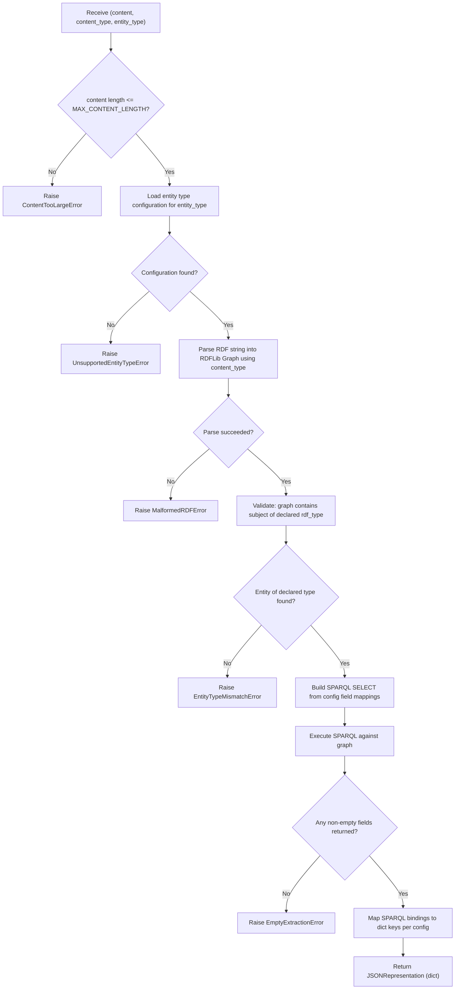

# Epic: ERS-EPIC-02 — RDF Mention Parser

## Status
- **Epic ID:** ERS-EPIC-02
- **Component:** #2 — RDF Mention Parser
- **Phase:** Gherkin features complete, ready for implementation
- **Spines:** A (Resolution Intake)
- **Last updated:** 2026-03-18
- **Dependencies:** ERS-EPIC-01 (JSONRepresentation model), er-spec library (domain models)

---

# Part 1 — Specification

## 1. Description

The RDF Mention Parser transforms raw RDF entity mention payloads into structured JSON dictionaries usable by ERS internally. It sits on the intake path (Spine A): before a request is registered in the Request Registry, the parser validates and extracts a JSONRepresentation from the submitted RDF content. If parsing fails, the request is rejected as a bad request.

The parser is configuration-driven. A YAML configuration file defines, per entity type, which RDF properties to extract and how to map them to JSON field names. Extraction uses SPARQL query templates constructed from the configuration. The output is a generic `dict[str, Any]` (the JSONRepresentation model defined in ERS-EPIC-01).

**Document type:** Implementation

## 2. Glossary

| Term | Definition |
|------|-----------|
| **EntityMention** | Immutable intake artefact: `content` (RDF string), `content_type` (MIME type), `EntityMentionIdentifier` (sourceId, requestId, entityType). From er-spec. |
| **JSONRepresentation** | Generic `dict[str, Any]` Pydantic wrapper. Defined in ERS-EPIC-01. ERS-internal only; never sent to ERE. |
| **Entity Type Configuration** | YAML artefact defining namespace prefixes, supported entity types, RDF types, and property-path-to-field mappings. |
| **Property Path** | Slash-separated RDF predicate chain (e.g., `cccev:registeredAddress/locn:postCode`). |
| **Content Type** | MIME type of RDF payload. Supported: `text/turtle` (default), `application/rdf+xml`. |
| **SPARQL Template** | SPARQL SELECT query dynamically built from entity type configuration. |

## 3. Algorithm / Flow



**Invocation point in Spine A:** Called during intake validation, before registration. Failure = 4xx rejection. Success = JSONRepresentation stored alongside raw content via update-and-extend on the request record.

## 4. Domain Model (Configuration)

Defined in this component. Does NOT exist in er-spec. Derived from basic ERE engine implementation.

### 4.1 Configuration YAML Structure

```yaml
namespaces:
  epo:   "http://data.europa.eu/a4g/ontology#"
  org:   "http://www.w3.org/ns/org#"
  locn:  "http://www.w3.org/ns/locn#"
  cccev: "http://data.europa.eu/m8g/"

entity_types:
  ORGANISATION:
    rdf_type: "org:Organization"
    fields:
      legal_name:   "epo:hasLegalName"
      country_code: "cccev:registeredAddress/epo:hasCountryCode"
      nuts_code:    "cccev:registeredAddress/epo:hasNutsCode"
      post_code:    "cccev:registeredAddress/locn:postCode"
      post_name:    "cccev:registeredAddress/locn:postName"
      thoroughfare: "cccev:registeredAddress/locn:thoroughfare"
```

### 4.2 Pydantic Models

```python
class EntityTypeConfig(BaseModel):
    """Configuration for a single entity type."""
    rdf_type: str          # Prefixed URI, e.g. "org:Organization"
    fields: dict[str, str] # key=output_field_name, value=property_path

class ParserConfig(BaseModel):
    """Root configuration model for the RDF Mention Parser."""
    namespaces: dict[str, str]                  # prefix -> URI
    entity_types: dict[str, EntityTypeConfig]    # type_key -> config
```

**Constraints:**
- `namespaces` must contain all prefixes used in `rdf_type` and `fields` values.
- `fields` values are slash-separated property paths; each segment uses a declared prefix.
- `entity_types` keys are uppercase identifiers (e.g., `ORGANISATION`).

### 4.3 Entity Type Resolution

`entity_type` in EntityMention is a full URI (e.g., `http://www.w3.org/ns/org#Organization`). Expand each config entry's `rdf_type` using `namespaces` and match. No match = `UnsupportedEntityTypeError`.

## 5. Adapter Specification (RDF Parser Adapter)

**Layer:** `adapters/` | **Dependency:** RDFLib

### 5.1 Interface

```python
class RDFParserAdapter:
    def parse_to_graph(self, content: str, content_type: str) -> rdflib.Graph:
        """Raises: MalformedRDFError, UnsupportedContentTypeError."""

    def execute_sparql(self, graph: rdflib.Graph, query: str) -> list[dict[str, str]]:
        """Returns list of result rows. Empty list if no results."""
```

### 5.2 Content Type Mapping

| MIME Type | RDFLib Format |
|-----------|--------------|
| `text/turtle` | `"turtle"` |
| `application/rdf+xml` | `"xml"` |

Other values raise `UnsupportedContentTypeError`. Adapter does NOT build queries; only executes them.

## 6. Service Specification (Mention Parser Service)

**Layer:** `services/` | **Dependencies:** `RDFParserAdapter`, `ParserConfig`, `JSONRepresentation` (EPIC-01)

### 6.1 Interface

```python
class MentionParserService:
    def __init__(self, config: ParserConfig, adapter: RDFParserAdapter) -> None: ...

    def parse(self, content: str, content_type: str, entity_type: str) -> dict[str, Any]:
        """Raises: ContentTooLargeError, UnsupportedEntityTypeError,
        UnsupportedContentTypeError, MalformedRDFError,
        EntityTypeMismatchError, EmptyExtractionError."""
```

### 6.2 SPARQL Query Construction

Generated from `EntityTypeConfig`. Example for ORGANISATION:

```sparql
PREFIX epo: <http://data.europa.eu/a4g/ontology#>
PREFIX org: <http://www.w3.org/ns/org#>
PREFIX locn: <http://www.w3.org/ns/locn#>
PREFIX cccev: <http://data.europa.eu/m8g/>
SELECT ?legal_name ?country_code ?nuts_code ?post_code ?post_name ?thoroughfare
WHERE {
  ?entity a org:Organization .
  OPTIONAL { ?entity epo:hasLegalName ?legal_name . }
  OPTIONAL { ?entity cccev:registeredAddress/epo:hasCountryCode ?country_code . }
  OPTIONAL { ?entity cccev:registeredAddress/epo:hasNutsCode ?nuts_code . }
  OPTIONAL { ?entity cccev:registeredAddress/locn:postCode ?post_code . }
  OPTIONAL { ?entity cccev:registeredAddress/locn:postName ?post_name . }
  OPTIONAL { ?entity cccev:registeredAddress/locn:thoroughfare ?thoroughfare . }
}
```

Design: OPTIONAL per field (partial data OK); no LIMIT (multi-entity guard is in the service); `?entity a <rdf_type>` anchors subject; SPARQL 1.1 property paths. Built with `string.Template`.

### 6.3 Constants

| Constant | Value | Rationale |
|----------|-------|-----------|
| `MAX_CONTENT_LENGTH` | 1,048,576 bytes (1 MB) | Memory protection. Env var: `ERS_PARSER_MAX_CONTENT_LENGTH`. |
| `SUPPORTED_CONTENT_TYPES` | `{"text/turtle", "application/rdf+xml"}` | Initial formats. |

### 6.4 OpenTelemetry Observability

Service level only (constraint #9). Implemented via `ers.commons.adapters.tracing`.
Full design: `docs/superpowers/specs/2026-03-21-observability-design.md`.

**Signature refactor:** `MentionParserService.parse()` must be refactored from
`(content, content_type, entity_type)` to accept `EntityMention` directly. This
enables the registered `EntityMention` extractor in `commons/adapters/span_extractors.py`
to provide span attributes automatically — no lambda at the call site.

```python
@trace_function(span_name="mention_parser.parse")
def parse(self, entity_mention: EntityMention) -> dict[str, Any]:
    ...
```

Span attributes provided by the `EntityMention` extractor:
`entity_mention.source_id`, `entity_mention.request_id`,
`entity_mention.entity_type`, `entity_mention.content_length`

- Logging (`logger.warning`, `logger.info`) already in place — no changes needed
- Never capture `entity_mention.content` (raw RDF) in spans — PII/size risk

## 7. Anti-Patterns (DO NOT)

| Don't | Do Instead | Why |
|-------|-----------|-----|
| Use rdflib directly in service layer | Delegate to `RDFParserAdapter` | DIP: services must not depend on infrastructure libs |
| Hardcode namespace URIs or field mappings | Load from `ParserConfig` YAML | Config-driven; new entity types = YAML change only |
| Log raw RDF content | Log only metadata: entity_type, content_type, content_length | PII risk; payload size |
| Catch rdflib exceptions generically | Map to specific domain errors (MalformedRDFError, etc.) | Callers need distinct types for HTTP status codes |
| Interpolate user input into SPARQL | Match entity_type against config; use only config-derived URIs | SPARQL injection prevention |
| Treat JSONRepresentation as authoritative | Preserve raw `content` + `content_type`; JSON is derived | Immutability invariant (conceptual-model.adoc, Section 9.1) |
| Add logging/tracing in adapter | Keep OTel in `MentionParserService` only | Architectural constraint #9 |

## 8. Test Case Specifications

### Unit Tests

| Test ID | Component | Input | Expected Output | Edge Cases |
|---------|-----------|-------|-----------------|------------|
| TC-001 | ParserConfig | Valid YAML | ParserConfig with 1 type, 6 fields | Empty namespaces; empty fields |
| TC-002 | ParserConfig | Undefined prefix in rdf_type | ValidationError | Prefix in fields but not namespaces |
| TC-003 | Entity type resolution | Full URI + matching config | Correct EntityTypeConfig | Trailing slash vs fragment; unknown URI |
| TC-004 | parse_to_graph | Valid Turtle | Graph with >0 triples | Empty string; whitespace; binary |
| TC-005 | parse_to_graph | Valid RDF/XML | Graph with >0 triples | Malformed XML; valid XML no RDF |
| TC-006 | parse_to_graph | content_type="application/json" | UnsupportedContentTypeError | Empty string; None |
| TC-007 | execute_sparql | Graph + valid SPARQL | list[dict] with 1 row | No matching triples = empty list |
| TC-008 | SPARQL builder | ORGANISATION config | Correct PREFIX/SELECT/OPTIONAL/LIMIT | Single field; 10+ fields |
| TC-009 | Service.parse | Valid Turtle org | dict with all 6 keys | Only legal_name present (partial) |
| TC-010 | Service.parse | Content > 1 MB | ContentTooLargeError | Exactly at limit (pass); 1 byte over |
| TC-011 | Service.parse | Person Turtle, org config | EntityTypeMismatchError | Multiple types incl. expected |
| TC-012 | Service.parse | Org Turtle, no configured fields | EmptyExtractionError | One field with empty string |
| TC-013 | Service.parse | Malformed Turtle | MalformedRDFError | Truncated; encoding issues |

### Integration Tests

| Test ID | Flow | Setup | Verification | Teardown |
|---------|------|-------|--------------|----------|
| IT-001 | Full Turtle parse | ORGANISATION config + sample Turtle | Dict values match Turtle content | None |
| IT-002 | Full RDF/XML parse | Same config + equivalent RDF/XML | Dict matches IT-001 output | None |
| IT-003 | Config from file | YAML file on disk | ParserConfig loads; type resolution works | Clean temp |

## 9. Error Handling Matrix

| Error Type | Detection | HTTP | Response Message | Log Level |
|------------|-----------|------|-----------------|-----------|
| `ContentTooLargeError` | `len(content.encode()) > MAX_CONTENT_LENGTH` | 413 | "Content exceeds max size of {MAX_CONTENT_LENGTH} bytes." | WARN |
| `UnsupportedEntityTypeError` | URI not in expanded config | 422 | "Entity type '{entity_type}' not supported." | WARN |
| `UnsupportedContentTypeError` | Not in SUPPORTED_CONTENT_TYPES | 415 | "Content type '{content_type}' not supported." | WARN |
| `MalformedRDFError` | rdflib parse exception | 400 | "Content is not valid {content_type}." | ERROR |
| `EntityTypeMismatchError` | No subject of declared rdf_type in graph | 422 | "No entity of type '{entity_type}' in content." | WARN |
| `MultipleEntitiesFoundError` | SPARQL returns >1 row | 422 | "Expected exactly 1 entity of type '...', found N." | WARN |
| `EmptyExtractionError` | All SPARQL result values None/empty | 422 | "No data extracted for type '{entity_type}'." | WARN |

All errors are FATAL. No partial results. Each maps to a specific exception in `models/errors.py`.

## 10. Risks and Assumptions

### Assumptions
1. RDFLib >= 6.0 supports SPARQL 1.1 property paths. (Verified.)
2. Payloads describe a single entity of a single type.
3. `entity_type` is always a full IRI.
4. ORGANISATION is the only MVP entity type.
5. JSONRepresentation (`dict[str, Any]`) is defined in ERS-EPIC-01.

### Risks

| Risk | Likelihood | Impact | Mitigation |
|------|-----------|--------|------------|
| Property paths + blank nodes = unexpected results | Medium | Medium | LIMIT 1; integration tests with real TED data |
| RDFLib performance on large payloads | Low | Medium | 1 MB cap; OTel span monitoring |
| Config schema evolves with new entity types | High | Low | Pydantic validation; loaded once at startup |
| er-spec model changes break field names | Low | High | Pin version; CI validation |

## 11. Architectural Constraints

1. **ERE Authority:** Parser does not produce canonical identifiers. JSONRepresentation is descriptive, ERS-internal.
2. **Triad Correlation:** Parser does not interact with the triad. Receives entity_type for config lookup only.
3. **Observability at Service Level:** OTel spans and logs in `MentionParserService` only.
4. **Reuse er-spec Models:** EntityMention, EntityMentionIdentifier from er-spec. ParserConfig defined locally.
5. **Layering:** models/ = ParserConfig + errors. adapters/ = RDFParserAdapter. services/ = MentionParserService. No reverse deps.
6. **Raw Content Immutability:** Parser never modifies original content/content_type.
7. **Configuration-Driven:** New entity type = YAML change only, no code change.

## 12. Dependencies

| Dependency | Type | Provides | Status |
|-----------|------|----------|--------|
| **ERS-EPIC-01** | Epic | JSONRepresentation type; request record storage | Pending |
| **er-spec** | Library | EntityMention, EntityMentionIdentifier | Available (v0.2.0-rc.2) |
| **RDFLib** | Package | rdflib.Graph, SPARQL | Available (>= 6.0) |
| **PyYAML + Pydantic** | Packages | Config loading, validation | Available |

## 13. Gherkin Feature Outline

At `tests/features/rdf_mention_parser/`:

### Feature: Parse RDF Organisation Mention

| Scenario | Description |
|----------|-------------|
| Parse valid Turtle with all fields | Happy path: 6 fields extracted |
| Parse valid RDF/XML | Same data, different format, same output |
| Parse with partial fields | Only legal_name + country_code; others null |
| Reject oversized content | > 1 MB = ContentTooLargeError |
| Reject unsupported content type | application/json = UnsupportedContentTypeError |
| Reject malformed Turtle | MalformedRDFError |
| Reject entity type mismatch | Person Turtle + org config = EntityTypeMismatchError |
| Reject empty extraction | No configured fields in RDF = EmptyExtractionError |
| Reject unsupported entity type | Unknown URI = UnsupportedEntityTypeError |

### Feature: Parser Configuration Loading

| Scenario | Description |
|----------|-------------|
| Load valid YAML | ParserConfig created successfully |
| Reject undefined prefix | ValidationError |
| Resolve URI to config entry | Full URI maps to correct EntityTypeConfig |

## 14. Task Breakdown and Roadmap

**Task 1: Define Configuration Models** -- models/ -- No deps -- Validate example YAML; reject invalid; URI resolution works.

**Task 2: Implement RDF Parser Adapter** -- adapters/ -- Needs Task 1 errors -- Parses Turtle + RDF/XML; correct errors; SPARQL execution.

**Task 3: Implement Mention Parser Service** -- services/ -- Needs Tasks 1+2 -- Full flow; all 6 errors; OTel instrumentation.

**Task 4: Configuration YAML and Loading** -- adapters/ -- Needs Task 1 -- Default YAML; env var for path.

**Task 5: Unit and Integration Tests** -- tests/ -- Needs Tasks 1-4 -- TC-001..013, IT-001..003; >= 90% coverage.

**Task 6: Gherkin Features** -- tests/features/ -- Needs Tasks 1-4 -- All scenarios pass via pytest-bdd.

## Roadmap
- [x] Task 1: Define Configuration Models (domain) — `EntityTypeConfig`, `RDFMappingConfig`, `UnsupportedEntityTypeError`
- [x] Task 2: Implement RDF Parser Adapter (adapters) — RDFLib graph parsing + SPARQL execution
- [x] Task 3: Implement Mention Parser Service (services) — full parse flow; `build_sparql_query` (string.Template, no LIMIT 1); `MultipleEntitiesFoundError`; public API `load_config` + `parse_entity_mention`; 23/23 unit tests passing
- [x] Task 4: Configuration YAML and Loading (adapters) — `RDFConfigReader` + unit tests + Gherkin features (parser_configuration.feature 12/12)
- [ ] Task 5: Unit and Integration Tests (tests) — TC-001..013, IT-001..003; >= 90% coverage
- [ ] Task 6: Gherkin Features (tests/features)

## 15. References

| Topic | Location | Section |
|-------|----------|---------|
| ERE Interface Contract | `docs/modules/ROOT/pages/ERS-ERE-Contarct/interface.adoc` | Entity Mention |
| ERE Data Model + LinkML | `docs/modules/ROOT/pages/ERS-ERE-Contarct/suppliment.adoc` | The ERE Data Model |
| ERE Configuration | `docs/modules/ROOT/pages/ERS-ERE-Contarct/suppliment.adoc` | Configuration |
| Entity Type Configuration glossary | `docs/modules/ROOT/pages/AnnexeA-Glossary/glossary-2.adoc` | Entity Type Configuration row |
| Entity Mention Representation glossary | `docs/modules/ROOT/pages/AnnexeA-Glossary/glossary-1.adoc` | Entity Mention Representation row |
| JSONRepresentation (conceptual) | `docs/modules/ROOT/pages/ERSArchitecture/conceptual-model.adoc` | Section 9.2 |
| JSONRepresentation (preview) | `docs/modules/ROOT/pages/ERSArchitecture/conceptual-model.adoc` | Section 9.5 |
| Spine A flow | `docs/modules/ROOT/pages/ERSArchitecture/spine-a.adoc` | Full section |
| UC-B1.1 | `docs/modules/ROOT/pages/AnnexeB-UseCases/ucb11.adoc` | Full section |
| ADR-C1N | `docs/modules/ROOT/pages/AnnexeC-ADRs/adrc1.adoc` | Full section |
| ADR-F1N | `docs/modules/ROOT/pages/AnnexeC-ADRs/adrf1.adoc` | Full section |
| er-spec models | `https://github.com/OP-TED/entity-resolution-spec/blob/0.2.0-rc.2/src/erspec/models/ere.py` | External |
| Planning roadmap | `.claude/memory/planning-roadmap.md` | Component #2 |

---
<!-- implementation-log -->
---

# Part 2 — Implementation Log

<!-- Written and updated by the implementer during Phase 3. -->

---

## Clarity Gate Assessment

**Document type:** Implementation | **Date:** 2026-03-12

### 13-Item Checklist

#### Foundation Checks
- [x] **Actionable** -- Concrete classes, methods, error types, config structures throughout.
- [x] **Current** -- Reflects developer answers from 2026-03-12 Q&A.
- [x] **Single Source** -- Config model here only; JSONRepresentation via pointer to EPIC-01.
- [x] **Decision, Not Wish** -- All decided: error types, SPARQL strategy, LIMIT 1, YAML format.
- [x] **Prompt-Ready** -- Every section usable as direct implementer input.
- [x] **No Future State** -- No "might", "eventually", "ideally".
- [x] **No Fluff** -- No motivational content.

#### Document Architecture Checks
- [x] **Type Identified** -- Implementation (Section 1).
- [x] **Anti-patterns Placed** -- Section 7, 7 entries.
- [x] **Test Cases Placed** -- Section 8, 13 unit + 3 integration tests.
- [x] **Error Handling Placed** -- Section 9, 6 error types with HTTP codes.
- [x] **Deep Links Present** -- Section 15, 13 references with file paths.
- [x] **No Duplicates** -- JSONRepresentation by pointer, not redefined.

### Scoring

| Criterion | Weight | Score | Rationale |
|-----------|--------|-------|-----------|
| Actionability | 25% | 10 | Concrete interfaces, models, constants, errors |
| Specificity | 20% | 9 | Thresholds explicit; SPARQL verbatim; minor gap: Pydantic validator for prefix cross-ref described not coded |
| Consistency | 15% | 10 | Single source for config; JSONRepresentation delegated |
| Structure | 15% | 10 | Tables throughout; Mermaid diagram; clear hierarchy |
| Disambiguation | 15% | 10 | 7 anti-patterns; 6 errors with HTTP codes; edge cases per test |
| Reference Clarity | 10% | 10 | 13 deep links with paths and sections |

**Score: 9.8/10** -- PASS. Ready for implementation.
