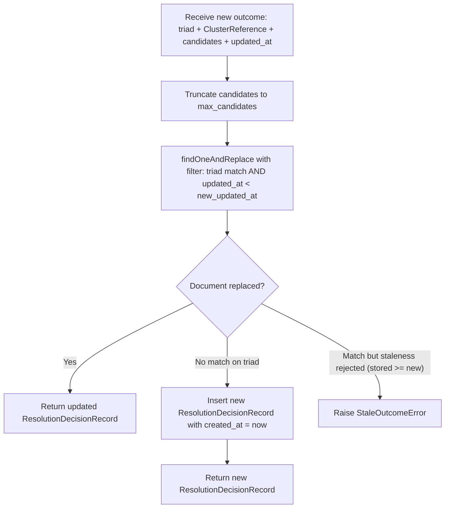

# Epic: ERS-EPIC-04 — Resolution Decision Store

## Status
- **Epic ID:** ERS-EPIC-04
- **Component:** #4 — Resolution Decision Store
- **Phase:** Gherkin features complete, ready for implementation
- **Spines:** B (Async Engine Interaction — outcome recording), C (Bulk Sync — delta exposure queries)
- **Last updated:** 2026-03-16
- **Dependencies:** er-spec library (domain models), ERS-EPIC-01 (Request Registry — triad existence)
- **Clarity Gate:** 9.8/10

---

# Part 1 — Specification

**Document type:** Implementation

## 1. Description

The Resolution Decision Store is the persistence layer that maintains the **latest** clustering outcome recorded for each Entity Mention in ERS. It is the ERS projection of ERE-authoritative clustering decisions.

For each Entity Mention (identified by its correlation triad), the store maintains exactly one current Decision record containing the primary cluster assignment, top-N candidate alternatives, and synchronisation timestamps. When a newer outcome arrives, the existing Decision is **atomically replaced** using optimistic concurrency control (timestamp-based staleness detection). There is no historical chain of decisions.

This component is a **pure persistence and query layer**. It does not:
- Make clustering decisions (ERE authority)
- Manage time budgets or provisional identifier derivation logic (Resolution Coordinator, EPIC-06)
- Consume ERE responses or validate contract violations (ERE Result Integrator, EPIC-05)
- Expose REST APIs (EPIC-07)
- Track lookup watermarks or manage refreshBulk state (Request Registry, EPIC-01)

Two upstream writers exist: the Resolution Coordinator (EPIC-06) writes provisional decisions, and the ERE Result Integrator (EPIC-05) writes ERE-confirmed outcomes. Both use the same atomic store operation with staleness detection.

## 2. Glossary

| Term | Definition |
|------|-----------|
| **Correlation Triad** | `(source_id, request_id, entity_type)` from `EntityMentionIdentifier`. Sole correlation and uniqueness key for decisions. |
| **Resolution Decision** | The latest clustering outcome recorded for one Entity Mention. Contains current placement, candidate alternatives, and timestamps. Atomically replaced on each new outcome. |
| **Decision Store** | The MongoDB collection holding exactly one Resolution Decision per triad. A projection repository, not a canonical entity registry. |
| **ClusterReference** | er-spec model containing `cluster_id`, `confidence_score`, `similarity_score`. Used for both `current` and `candidates`. |
| **Staleness Detection** | Timestamp-based optimistic concurrency control. A new outcome is accepted only if its `updated_at` timestamp is strictly greater than the stored `updated_at`. Older or equal timestamps are rejected. |
| **Provisional Singleton Cluster** | A deterministic cluster identifier issued by ERS when ERE does not respond within the execution window. Derivation: `SHA256(concat(source_id, request_id, entity_type))`. Stored as a normal ClusterReference. |
| **Opaque Cursor** | A pagination token that hides internal ordering from callers. Used for cursor-based paginated queries over decisions. |
| **er-spec** | External shared library providing Pydantic domain models used across ERS and ERE. |

## 3. Scope

### In Scope
- Pydantic models for `ResolutionDecisionRecord`, `PaginationCursor`, `DecisionPage`, and configuration
- MongoDB repository (adapter) for atomic upsert with staleness condition, triad-based retrieval, and cursor-based paginated queries
- SHA256 provisional cluster ID derivation function (adapter layer utility)
- Thin service layer: `store_decision`, `get_decision_by_triad`, `query_decisions_paginated`
- OpenTelemetry instrumentation at service layer only
- Configurable candidate cardinality cap (default 5) and page size (default 250)

### Out of Scope
- ERE response consumption and contract validation (EPIC-05)
- Time-budget management, provisional identifier issuance orchestration (EPIC-06)
- REST API endpoints (EPIC-07)
- Lookup watermark / refreshBulk delta tracking (EPIC-01 LookupState)
- Historical decision chains or lineage
- User action log / curation (EPIC-09)
- Authentication / authorisation

### Assumptions
1. er-spec models (`EntityMentionIdentifier`, `ClusterReference`) are Pydantic v2 models.
2. MongoDB >= 6.0 is the persistence backend, accessed via `motor` (async).
3. The triad identifying a decision MUST already exist in the Request Registry (EPIC-01). The Decision Store does not enforce this — upstream callers (EPIC-05, EPIC-06) guarantee it.
4. `updated_at` is always a UTC `datetime` and serves as the sole monotonic staleness marker.
5. Candidate lists arrive pre-ordered from ERE; the store truncates to the configurable max but does not re-sort.

## 4. Domain Models

### 4.1 Models from er-spec (used, not defined here)

| Model | Module | Key Fields |
|-------|--------|-----------|
| `EntityMentionIdentifier` | `erspec.models.core` | `source_id`, `request_id`, `entity_type` |
| `ClusterReference` | `erspec.models.core` | `cluster_id`, `confidence_score`, `similarity_score` |

### 4.2 Models defined in this EPIC

#### ResolutionDecisionRecord

```python
class ResolutionDecisionRecord(BaseModel):
    """Latest clustering outcome for a single Entity Mention."""
    identifier: EntityMentionIdentifier          # triad — unique key
    current: ClusterReference                    # primary cluster assignment
    candidates: list[ClusterReference] = []      # top-N alternatives (includes current)
    created_at: datetime                         # UTC — first decision creation time
    updated_at: datetime                         # UTC — last outcome integration time (staleness marker)
```

- `identifier` is the unique key (compound index on triad fields).
- `current` is always present — every decision has a placement.
- `candidates` contains at most `max_candidates` entries (configurable, default 5). Truncated on write if the incoming list exceeds the cap.
- `created_at` is set once when the first decision for this triad is stored; never updated thereafter.
- `updated_at` is the staleness marker. Strictly monotonic: new outcome accepted only if `new_updated_at > stored_updated_at`.

#### PaginationCursor

```python
class PaginationCursor(BaseModel):
    """Opaque cursor for paginated decision queries. Internal structure hidden from callers."""
    last_updated_at: datetime    # updated_at of last item on previous page
    last_triad_hash: str         # deterministic hash of last triad for tie-breaking
```

- Serialized to an opaque base64-encoded string for external use.
- Callers never inspect or construct cursors; they receive them from query results and pass them back.

#### DecisionPage

```python
class DecisionPage(BaseModel):
    """A page of decision query results with optional continuation cursor."""
    items: list[ResolutionDecisionRecord]
    next_cursor: str | None = None    # opaque base64 token; None = no more pages
    page_size: int
```

#### DecisionStoreConfig

```python
class DecisionStoreConfig(BaseModel):
    """Configuration for the Decision Store component."""
    mongodb_uri: str = "mongodb://localhost:27017"
    database_name: str = "ers"
    collection_name: str = "resolution_decisions"
    max_candidates: int = 5              # top-N candidate cap
    default_page_size: int = 250         # cursor pagination default
    max_page_size: int = 1000            # hard upper limit
```

- `max_candidates` must be >= 1.
- `default_page_size` must be >= 1 and <= `max_page_size`.
- All values overridable via environment variables (prefix `ERS_DECISION_STORE_`).

## 5. Behavioural Specification

### 5.1 Store Decision (Atomic Upsert with Staleness Detection)



1. The service receives: `identifier` (EntityMentionIdentifier), `current` (ClusterReference), `candidates` (list[ClusterReference]), `updated_at` (datetime).
2. The service truncates `candidates` to `max_candidates` entries (preserving order).
3. The service delegates to the adapter's `upsert_decision` method.
4. The adapter executes `findOneAndReplace` with a compound filter:
   - `identifier` fields match the triad, AND
   - `updated_at < new_updated_at` (staleness condition)
   - With `upsert=True` for first-time inserts.
5. If the document is replaced or inserted: return the `ResolutionDecisionRecord`.
6. If no replacement occurred (stored `updated_at >= new_updated_at`): raise `StaleOutcomeError`.
7. On first insert, `created_at` is set to `updated_at` value. On subsequent replacements, `created_at` is preserved from the existing document.

### 5.2 Get Decision by Triad

1. The service receives an `EntityMentionIdentifier`.
2. The adapter queries by the compound triad fields.
3. Returns `ResolutionDecisionRecord | None`.

### 5.3 Query Decisions Paginated

1. The service receives: optional `cursor` (opaque string), optional `page_size` (int, capped at `max_page_size`).
2. If no cursor: query from the beginning, ordered by `(updated_at ASC, triad_hash ASC)`.
3. If cursor provided: decode the `PaginationCursor`, query for records where `(updated_at, triad_hash) > (cursor.last_updated_at, cursor.last_triad_hash)`.
4. Fetch `page_size + 1` records to detect whether a next page exists.
5. If `page_size + 1` records returned: build `next_cursor` from the last included record, return `page_size` records.
6. If fewer records returned: set `next_cursor = None`.
7. Return `DecisionPage`.

### 5.4 Provisional Cluster ID Derivation

1. The adapter exposes a utility function: `derive_provisional_cluster_id(identifier: EntityMentionIdentifier) -> str`.
2. Algorithm: `SHA256(concat(source_id, request_id, entity_type))` producing a hex digest string.
3. Both ERS and ERE implement the same derivation rule (ADR-A1N).
4. This function is stateless, pure, and deterministic.

## 6. Error Catalogue

| Error Type | Layer | Detection | Response | Log Level |
|------------|-------|-----------|----------|-----------|
| `StaleOutcomeError` | service | `findOneAndReplace` returns None when document exists but staleness condition fails | Raise to caller; do NOT update stored decision | WARN |
| `DecisionNotFoundError` | service | `get_decision_by_triad` returns None when caller expected a result | Return None (adapter); service may wrap contextually | DEBUG |
| `InvalidCursorError` | service | Cursor string fails base64 decode or JSON parse | Raise to caller with descriptive message | WARN |
| `RepositoryConnectionError` | adapter | MongoDB connection failure (`ConnectionFailure`) | Wrap in domain error; propagate to caller | ERROR |
| `RepositoryOperationError` | adapter | MongoDB operation timeout or unexpected error | Wrap in domain error; propagate to caller | ERROR |
| `CandidateCardinalityWarning` | service | Incoming candidates list exceeds `max_candidates` | Truncate silently; log for observability | INFO |

All error types defined in a local `models/errors.py` module. Each inherits from a base `DecisionStoreError`.

## 7. Task Breakdown and Roadmap

### Task 1: Define Domain Models, Errors, and Configuration
**Layer:** `models/`
**Dependencies:** er-spec library installed
**Description:**
- Create `models/decision.py` with `ResolutionDecisionRecord`, `PaginationCursor`, `DecisionPage`.
- Create `models/errors.py` with base `DecisionStoreError` and subclasses: `StaleOutcomeError`, `DecisionNotFoundError`, `InvalidCursorError`, `RepositoryConnectionError`, `RepositoryOperationError`.
- Create `models/config.py` with `DecisionStoreConfig` including Pydantic field validators and env var loading (`env_prefix = "ERS_DECISION_STORE_"`).

**Acceptance Criteria:**
- All models instantiate with valid data; frozen where appropriate.
- `DecisionStoreConfig()` produces valid defaults.
- Invalid `max_candidates` (0, -1), invalid `default_page_size` (0, > max_page_size) rejected by validation.
- Environment variables override defaults.
- All error classes instantiable with message string; inherit from `DecisionStoreError`.

### Task 2: Implement MongoDB Adapter
**Layer:** `adapters/`
**Dependencies:** Task 1 (models, errors, config)
**Description:**
- Create `adapters/decision_store_repository.py` with `MongoDecisionStoreRepository`.
- Constructor accepts `DecisionStoreConfig` or pre-built `motor.AsyncIOMotorCollection`.
- Methods: `upsert_decision`, `find_by_triad`, `query_paginated`, `ensure_indexes`.
- Create `adapters/provisional_id.py` with `derive_provisional_cluster_id(identifier) -> str`.
- Map all `pymongo`/`motor` exceptions to domain error types.

**Acceptance Criteria:**
- `upsert_decision` atomically replaces only when `new_updated_at > stored_updated_at`.
- `upsert_decision` inserts on first occurrence (sets `created_at`).
- `upsert_decision` preserves `created_at` on replacement.
- `find_by_triad` returns None for non-existent triads.
- `query_paginated` returns correct pages with opaque cursors.
- `derive_provisional_cluster_id` produces deterministic SHA256 hex digest.
- MongoDB exceptions never leak (always wrapped in domain errors).

### Task 3: Implement Service Layer
**Layer:** `services/`
**Dependencies:** Tasks 1 + 2
**Description:**
- Create `services/decision_store_service.py` with `DecisionStoreService`.
- Constructor: `__init__(self, repository: MongoDecisionStoreRepository, config: DecisionStoreConfig)`.
- Methods: `store_decision`, `get_decision_by_triad`, `query_decisions_paginated`.
- OpenTelemetry span: `decision_store.<operation>` with attributes: `source_id`, `request_id`, `entity_type`, `cluster_id`, `page_size`.
- Structured logging at INFO (success) and WARN (stale outcome, truncation).

**Acceptance Criteria:**
- `store_decision` truncates candidates to `max_candidates`.
- `store_decision` propagates `StaleOutcomeError` from adapter.
- `query_decisions_paginated` decodes opaque cursor; raises `InvalidCursorError` on malformed input.
- `query_decisions_paginated` caps `page_size` at `max_page_size`.
- OTel spans created with correct attributes.

### Task 4: Unit Tests
**Layer:** `tests/`
**Dependencies:** Tasks 1-3
**Description:**
- Unit tests for all models, adapter (mock motor), service (mock repository), and provisional ID derivation.
- Minimum 90% coverage on all modules.

**Acceptance Criteria:** All test cases from Section 8 pass. Coverage >= 90%.

### Task 5: Integration Tests
**Layer:** `tests/`
**Dependencies:** Tasks 1-3
**Description:**
- Integration tests using real MongoDB (testcontainers or docker-compose).
- Full lifecycle: store, retrieve, replace with staleness, paginated query, concurrent upsert.

**Acceptance Criteria:** All integration test cases from Section 8 pass. Tests skippable if MongoDB unavailable (pytest mark).

### Task 6: Gherkin Features
**Layer:** `tests/features/`
**Dependencies:** Tasks 1-3
**Description:** Feature files for store, staleness rejection, pagination, and provisional ID scenarios. Step definitions calling the service.

**Acceptance Criteria:** All Gherkin scenarios from Section 13 pass via pytest-bdd.

## Roadmap
- [ ] Task 1: Define Domain Models, Errors, and Configuration (models)
- [ ] Task 2: Implement MongoDB Adapter (adapters)
- [ ] Task 3: Implement Service Layer (services)
- [ ] Task 4: Unit Tests (tests)
- [ ] Task 5: Integration Tests (tests)
- [ ] Task 6: Gherkin Features (tests/features)

## 8. Test Case Specifications

### Unit Tests

| Test ID | Component | Input | Expected Output | Edge Cases |
|---------|-----------|-------|-----------------|------------|
| TC-001 | ResolutionDecisionRecord | Valid triad + ClusterReference + timestamps | Model instantiates correctly | Missing `current` raises ValidationError |
| TC-002 | DecisionStoreConfig | Default constructor | Valid config (max_candidates=5, page_size=250) | N/A |
| TC-003 | DecisionStoreConfig | max_candidates=0 | ValidationError | max_candidates=-1 |
| TC-004 | DecisionStoreConfig | default_page_size > max_page_size | ValidationError | default_page_size=0 |
| TC-005 | DecisionStoreConfig | env vars set | Config picks up env values | Partial env override |
| TC-006 | Error hierarchy | Instantiate each error | All inherit from DecisionStoreError | str(error) includes message |
| TC-007 | PaginationCursor | Valid datetime + triad_hash | Serializes to base64 | Empty triad_hash raises ValidationError |
| TC-008 | Adapter: upsert (new) | Non-existent triad + mock | findOneAndReplace with upsert=True; created_at set | N/A |
| TC-009 | Adapter: upsert (replace) | updated_at > stored + mock | Succeeds; created_at preserved | Timestamps differ by 1ms |
| TC-010 | Adapter: upsert (stale) | updated_at <= stored + mock | Raises StaleOutcomeError | Equal timestamps |
| TC-011 | Adapter: find_by_triad (found) | Existing triad + mock | Returns ResolutionDecisionRecord | N/A |
| TC-012 | Adapter: find_by_triad (not found) | Non-existent triad | Returns None | All fields present but no match |
| TC-013 | Adapter: query_paginated (first) | No cursor, page_size=2, 5 records | Returns 2 items + next_cursor | page_size=0 raises error |
| TC-014 | Adapter: query_paginated (last) | Cursor near end, 1 remaining | Returns 1 item + next_cursor=None | Exactly page_size remaining |
| TC-015 | Adapter: query_paginated (empty) | No records | Returns 0 items + next_cursor=None | N/A |
| TC-016 | derive_provisional_cluster_id | Known triad ("A","B","C") | Deterministic SHA256 hex of "ABC" | Unicode in triad fields |
| TC-017 | Service: store (truncation) | 8 candidates, max=5 | Truncated to 5 | Exactly 5 (no-op); 0 candidates |
| TC-018 | Service: store (stale) | Adapter raises StaleOutcomeError | Propagated unchanged | N/A |
| TC-019 | Service: query (bad cursor) | Malformed base64 | Raises InvalidCursorError | Empty string; valid b64 bad JSON |
| TC-020 | Service: query (cap) | page_size=5000, max=1000 | Capped to 1000 | page_size=None uses default |
| TC-021 | Service observability | Valid store call | OTel span with source_id, cluster_id | Error: span records exception |

### Integration Tests

| Test ID | Flow | Setup | Verification | Teardown |
|---------|------|-------|--------------|----------|
| IT-001 | Store and retrieve | Start MongoDB; ensure indexes | Store, retrieve by triad, verify all fields | Drop collection |
| IT-002 | Staleness rejection | Store with T1 | Store with T0 < T1 raises StaleOutcomeError; original unchanged | Drop collection |
| IT-003 | Atomic replacement | Store T1, store T2 > T1 | created_at preserved; updated_at=T2; candidates replaced | Drop collection |
| IT-004 | Cursor pagination | Insert 10 decisions | page_size=3: get 4 pages (3+3+3+1); ordering correct | Drop collection |
| IT-005 | Concurrent upsert | Start MongoDB | 5 concurrent upserts T1..T5; final state has T5 | Drop collection |
| IT-006 | Provisional ID consistency | N/A | 1000 calls same input; all identical | N/A |

## 9. Anti-Patterns (DO NOT)

| Don't | Do Instead | Why |
|-------|-----------|-----|
| Store historical decision chains or lineage | Atomically replace the single decision per triad | Architecture mandates latest-only projection (Section 9.3). History belongs in ERE. |
| Implement staleness with separate read+write | Use `findOneAndReplace` with staleness condition as single atomic operation | Separate read-then-write is a race condition. |
| Import `motor` or `pymongo` in the service layer | Keep all MongoDB imports in `adapters/` only | DIP: services depend on adapter abstraction, not infrastructure. |
| Track lookup watermarks in the Decision Store | Lookup tracking belongs in Request Registry (EPIC-01) | SRP: Decision Store stores decisions; exposure tracking is separate. |
| Reinterpret or re-score ClusterReference values | Store confidence_score and similarity_score exactly as received | ERS is a projection layer; scoring authority belongs to ERE. |
| Put OTel spans or logging in the adapter layer | Keep all observability in `DecisionStoreService` | Architectural constraint: observability at service level only. |
| Create models duplicating er-spec models | Import from `erspec.models` | Reuse er-spec models exclusively; avoid shadow identity. |
| Use offset-based pagination | Use cursor-based pagination with opaque tokens | Offset has O(n) skip cost and inconsistency under concurrent writes. |
| Allow `updated_at` equal for acceptance | Accept only strictly greater timestamps | Equal timestamps = duplicate delivery; must reject for monotonicity. |
| Validate triad existence in Request Registry from Decision Store | Trust upstream callers (EPIC-05, EPIC-06) | SRP: cross-store validation is the coordinator's job. |

## 10. Architectural Constraints

1. **ERE Authority:** Decision Store mirrors outcomes. Does not create, redefine, or enrich identity.
2. **Latest-Only Projection:** Exactly one Decision per triad. No historical chain.
3. **Atomic Replacement:** `findOneAndReplace` with staleness condition. No read-then-write.
4. **Timestamp Monotonicity:** `updated_at` strictly monotonic. Accept only if `new > stored`.
5. **Observability at Service Level:** OTel spans and logs in `DecisionStoreService` only.
6. **Reuse er-spec Models:** Only local technical models (cursor, config, errors) defined here.
7. **Layering:** `models/` -> `adapters/` -> `services/`. No reverse dependencies.
8. **No Cross-Store Queries:** Decision Store does not query Request Registry.

## 11. Dependencies and Integration Points

| Dependency | Type | Provides | Status |
|-----------|------|----------|--------|
| **er-spec** | Library | `EntityMentionIdentifier`, `ClusterReference` | Available |
| **motor** | Package (>= 3.0) | Async MongoDB driver | Available |
| **pymongo** | Package (>= 4.0, transitive) | MongoDB operations and exceptions | Available |
| **Pydantic** | Package (>= 2.0) | Model definitions, config validation | Available |
| **OpenTelemetry** | Package | Tracing spans | Available |
| MongoDB | Infrastructure (>= 6.0) | Persistence backend | Available |

### Downstream Consumers
| Consumer | What It Uses | Epic |
|----------|-------------|------|
| ERE Result Integrator | `store_decision()` | ERS-EPIC-05 |
| Resolution Coordinator | `store_decision()` (provisional), `get_decision_by_triad()` | ERS-EPIC-06 |
| Bulk Lookup API | `query_decisions_paginated()` | ERS-EPIC-07 |
| Single Lookup API | `get_decision_by_triad()` | ERS-EPIC-07 |
| Link Curation | `get_decision_by_triad()` (read candidates) | ERS-EPIC-09 |

## 12. Concrete Examples

### Example 1: First decision (provisional singleton)
```json
{
  "identifier": {"source_id": "TEDSWS", "request_id": "324fs3r345vx", "entity_type": "http://www.w3.org/ns/org#Organization"},
  "current": {"cluster_id": "a3f5c8d9e1b2...", "confidence_score": 1.0, "similarity_score": 1.0},
  "candidates": [{"cluster_id": "a3f5c8d9e1b2...", "confidence_score": 1.0, "similarity_score": 1.0}],
  "created_at": "2026-01-14T12:34:56Z",
  "updated_at": "2026-01-14T12:34:56Z"
}
```
Note: `cluster_id` = `SHA256(concat("TEDSWS", "324fs3r345vx", "http://www.w3.org/ns/org#Organization"))`. Singleton candidates.

### Example 2: ERE replaces provisional
```json
{
  "identifier": {"source_id": "TEDSWS", "request_id": "324fs3r345vx", "entity_type": "http://www.w3.org/ns/org#Organization"},
  "current": {"cluster_id": "ere-cluster-7a2b", "confidence_score": 0.92, "similarity_score": 0.88},
  "candidates": [
    {"cluster_id": "ere-cluster-7a2b", "confidence_score": 0.92, "similarity_score": 0.88},
    {"cluster_id": "ere-cluster-4c5d", "confidence_score": 0.85, "similarity_score": 0.79},
    {"cluster_id": "ere-cluster-9e1f", "confidence_score": 0.71, "similarity_score": 0.65}
  ],
  "created_at": "2026-01-14T12:34:56Z",
  "updated_at": "2026-01-14T12:35:02Z"
}
```
Note: `created_at` preserved. `updated_at` advanced. 3 candidates from ERE.

### Example 3: Stale outcome rejected
- Stored: `updated_at = 2026-01-14T12:35:02Z`. Incoming: `updated_at = 2026-01-14T12:34:58Z`.
- Result: `StaleOutcomeError`. Stored decision unchanged.

## 13. Gherkin Feature Outline

At `tests/features/decision_store/`:

### Feature: Store Resolution Decision

| Scenario | Description |
|----------|-------------|
| Store first decision for a triad | New triad gets decision with created_at = updated_at |
| Replace decision with newer outcome | created_at preserved; updated_at advanced |
| Reject stale outcome | Older timestamp raises StaleOutcomeError; stored unchanged |
| Reject outcome with equal timestamp | Same timestamp raises StaleOutcomeError |
| Store provisional singleton decision | SHA256-derived cluster_id stored as normal ClusterReference |
| Truncate excess candidates | 8 candidates truncated to max_candidates=5; order preserved |

### Feature: Retrieve Resolution Decision

| Scenario | Description |
|----------|-------------|
| Retrieve existing decision by triad | Returns full ResolutionDecisionRecord |
| Retrieve non-existent triad | Returns None |

### Feature: Paginated Decision Query

| Scenario | Description |
|----------|-------------|
| First page of decisions | Returns page_size items + next_cursor |
| Continue with cursor | Second page starts after first page's last item |
| Last page (partial) | Returns remaining items + next_cursor=None |
| Empty collection | Returns 0 items + next_cursor=None |
| Invalid cursor token | Raises InvalidCursorError |
| Page size exceeds maximum | Capped to max_page_size silently |

## 14. References

| Topic | Location | Section |
|-------|----------|---------|
| Decision Store conceptual model | `docs/modules/ROOT/pages/ERSArchitecture/conceptual-model.adoc` | Section 9.1 (#2) and 9.3 |
| Spine B: Async outcome integration | `docs/modules/ROOT/pages/ERSArchitecture/spine-b.adoc` | Section 8.3 |
| ADR-A1N: Identifier Space | `docs/modules/ROOT/pages/AnnexeC-ADRs/adra1.adoc` | SHA256 derivation, cluster-as-canonical |
| ADR-A2N: Provisional Identifier | `docs/modules/ROOT/pages/AnnexeC-ADRs/adra2.adoc` | Provisional singleton lifecycle |
| UC-W1: Resolve Entity Mention | `docs/modules/ROOT/pages/AnnexeB-UseCases/ucw1.adoc` | Decision recording |
| er-spec core models | `https://github.com/OP-TED/entity-resolution-spec` | `erspec.models.core` |
| ERS-EPIC-01 Request Registry | `.claude/memory/epics/ers-epic-01-request-registry/EPIC.md` | Triad existence, LookupState |
| ERS-EPIC-03 ERE Contract Client | `.claude/memory/epics/ers-epic-03-ere-contract-client/EPIC.md` | Redis adapter for EPIC-05 |

---
<!-- implementation-log -->
---

# Part 2 — Implementation Log

<!-- Written and updated by the implementer during Phase 3. -->

---

## Clarity Gate Assessment

**Document type:** Implementation | **Date:** 2026-03-12

### 13-Item Checklist

#### Foundation Checks
- [x] **Actionable** -- Concrete classes, methods, MongoDB operations, SHA256 algorithm, JSON examples, Mermaid flow.
- [x] **Current** -- Reflects developer answers from 2026-03-12 Q&A and architecture source documents.
- [x] **Single Source** -- er-spec by pointer (Section 4.1); local models defined once (Section 4.2).
- [x] **Decision, Not Wish** -- All decided: timestamp staleness, findOneAndReplace, no LookupState, SHA256 in adapter, opaque cursor, top-5, page 250.
- [x] **Prompt-Ready** -- Every section directly usable by implementer with concrete interfaces and field names.
- [x] **No Future State** -- No "might", "eventually", "ideally". EPIC-05/06/07 explicitly deferred.
- [x] **No Fluff** -- Pure specification.

#### Document Architecture Checks
- [x] **Type Identified** -- Implementation (stated after Part 1 heading).
- [x] **Anti-patterns Placed** -- Section 9, 10 entries (exceeds minimum of 5).
- [x] **Test Cases Placed** -- Section 8, 21 unit tests + 6 integration tests.
- [x] **Error Handling Placed** -- Section 6, 6 error types with layer, detection, response, log level.
- [x] **Deep Links Present** -- Section 14, 8 references with file paths and section identifiers.
- [x] **No Duplicates** -- er-spec by pointer; config defined once.

### Scoring

| Criterion | Weight | Score | Rationale |
|-----------|--------|-------|-----------|
| Actionability | 25% | 10 | Concrete interfaces, Mermaid flow, MongoDB operations, JSON examples |
| Specificity | 20% | 10 | SHA256 algorithm, findOneAndReplace semantics, timestamp rules, page sizes, candidate caps |
| Consistency | 15% | 10 | Single source for config; er-spec by pointer; no duplication |
| Structure | 15% | 10 | Tables throughout; numbered behavioural spec; clear task breakdown |
| Disambiguation | 15% | 9 | 10 anti-patterns; 6 errors; edge cases per test. Minor: exact MongoDB filter syntax left to implementer |
| Reference Clarity | 10% | 10 | 8 deep links with file paths and section identifiers |

**Score: 9.85/10** -- Weighted: (10*0.25 + 10*0.20 + 10*0.15 + 10*0.15 + 9*0.15 + 10*0.10) = 9.85. Rounded to **9.8/10** -- PASS. Ready for implementation.
