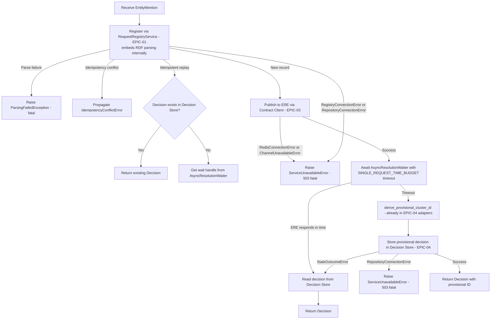

# Epic: ERS-EPIC-06 — Resolution Coordinator

## Status
- **Epic ID:** ERS-EPIC-06
- **Component:** #6 — Resolution Coordinator
- **Phase:** Task files written, ready for implementation
- **Spines:** A (Resolution Intake), B (Async Engine Interaction), C (Bulk Cluster Refresh)
- **Last updated:** 2026-05-05

### Decision history

| Date | Change | PR / Source |
|------|--------|-------------|
| 2026-05-05 | **Infrastructure-failure contract clarified to (a):** Redis, channel, and MongoDB unavailability all raise `ServiceUnavailableError` → HTTP 503. The previous "Redis down → graceful provisional degradation" rule is removed. PROVISIONAL outcomes are issued only on **ERE timeout** (the engine was reachable but did not respond within the budget). Treats infrastructure outage as an operational alarm, not a graceful degrade. | PR #97 (`feature/ERS1-213`) — NFR gap remediation |
- **Dependencies:** EPIC-01 (Request Registry — parse+register bundled), EPIC-03 (ERE Contract Client), EPIC-04 (Resolution Decision Store), EPIC-05 (ERE Result Integrator — `AsyncResolutionWaiter.notify` wired via EPIC-07 lifespan)
- **Note:** EPIC-02 (RDF Mention Parser) is NOT a direct dependency — `RequestRegistryService.register_resolution_request` embeds RDF parsing internally.
- **Clarity Gate:** Score: 9.85/10

---

# Part 1 — Specification

**Document type:** Implementation

## 1. Description

The Resolution Coordinator is the **service-layer orchestrator** for Spines A, B, and C. It receives entity mention resolution requests, coordinates registration (EPIC-01 — which also embeds RDF parsing), engine submission (EPIC-03), and decision persistence (EPIC-04), then returns a canonical or provisional cluster identifier to the caller within the request time budget.

This component is a pure **service** — it defines no new entrypoints (EPIC-07 provides the REST API) and no new adapters. It orchestrates existing services from dependency EPICs.

The Coordinator owns four critical responsibilities:

1. **Intake orchestration** — register and publish each Entity Mention through the resolution pipeline (RDF parsing is embedded in the registry service)
2. **Time budget enforcement** — single and bulk requests have separate budgets; issue provisional identifiers when the budget expires before ERE responds
3. **Bulk decomposition** — break multi-mention requests into independent concurrent single-mention resolutions
4. **Bulk cluster refresh** — return delta of changed cluster assignments since the last snapshot (Spine C, `BulkRefreshCoordinatorService`)

The Coordinator does NOT:
- Make clustering decisions (ERE authority)
- Consume ERE responses directly (EPIC-05: ERE Result Integrator)
- Expose HTTP endpoints (EPIC-07: ERS REST API)
- Define new domain models (reuses er-spec and dependency EPIC models)

## 2. Glossary

| Term | Definition |
|------|-----------|
| **Correlation Triad** | `(source_id, request_id, entity_type)` — sole correlation and uniqueness key across ERS-ERE. |
| **Single Request Time Budget** | Maximum time ERS may spend before returning a response for a single-mention resolution. Doubles as the ERE wait window — on expiry the coordinator issues a provisional and returns. Env var: `ERS_COORDINATOR_SINGLE_REQUEST_TIME_BUDGET`, default 30s. |
| **Bulk Request Time Budget** | Maximum time ERS may spend before returning a response for a bulk resolve call. Fatal if exceeded. Env var: `ERS_COORDINATOR_BULK_REQUEST_TIME_BUDGET`, default 120s. |
| **Provisional Singleton ID** | Deterministically derived cluster identifier: `SHA256(concat(source_id, request_id, entity_type))`. Issued when ERE does not respond within the execution window. |
| **Draft Identifier** | Synonym for Provisional Singleton ID. Used interchangeably in source architecture documents. |
| **AsyncResolutionWaiter** | In-process coordination component that manages `asyncio.Event` objects keyed by triad. Allows the Coordinator to await ERE responses signalled by EPIC-05. |
| **Idempotent Replay** | Resubmission of the same triad with identical content. Returns the existing decision from the Decision Store. |
| **Idempotency Conflict** | Resubmission of the same triad with different content. Rejected with explicit error. |
| **Bulk Decomposition** | Breaking a multi-mention request into independent single-mention resolutions executed concurrently. |
| **er-spec** | Shared library providing domain models used across ERS and ERE. |

## 3. Scope

### In Scope

- `ResolutionCoordinatorService` — Spine A+B intake: register, publish, wait, provisional fallback
- `BulkRefreshCoordinatorService` — Spine C: delta lookup, snapshot advance, source-not-found guard
- `AsyncResolutionWaiter` — in-process event coordination between coordinator and EPIC-05
- Separate time budgets: `SINGLE_REQUEST_TIME_BUDGET` (also ERE wait window) and `BULK_REQUEST_TIME_BUDGET`
- Provisional singleton ID reuse: `derive_provisional_cluster_id` already exists at `ers.resolution_decision_store.adapters.provisional_id` — import, do not redefine
- Bulk decomposition via `asyncio.gather(..., return_exceptions=True)`
- Idempotent replay, idempotency conflict detection
- Infrastructure outages (Redis, channel, MongoDB) translated to `ServiceUnavailableError` (HTTP 503) — see Decision history (2026-05-05)
- `DecisionStoreService.query_decisions_delta` extension (source + snapshot filter)
- `RequestRegistryService.source_has_requests` extension (Spine C unknown-source guard)
- Exception hierarchy: `CoordinatorException` base → `ResolutionTimeoutException`, `ParsingFailedException`, `SourceNotFoundException`. Infrastructure-outage signalling reuses `ServiceUnavailableError` from `ers.commons.services.exceptions` (shared with the curation API).
- Config via `ERSConfigResolver` (`ERS_COORDINATOR_SINGLE_REQUEST_TIME_BUDGET`, `ERS_COORDINATOR_BULK_REQUEST_TIME_BUDGET`)
- OpenTelemetry instrumentation at module-level public functions (not class methods)

### Out of Scope

- ERE response consumption and Decision Store updates from ERE outcomes (EPIC-05)
- REST API / HTTP entrypoints (EPIC-07 — wired in T6.7 but not defined here)
- RDF parsing logic — parsing is embedded in `RequestRegistryService.register_resolution_request`; Coordinator never calls a parser service directly
- Request Registry, Decision Store, ERE Contract Client internals (EPIC-01, -03, -04)
- Retry policies for ERE publishing (on infrastructure failure, raise `ServiceUnavailableError`; no retries, no provisional fallback)
- User-initiated curation flows (EPIC-09, Spine D)
- Authentication / authorisation

### Assumptions

1. All dependency services (EPIC-01 through EPIC-04) are available as injectable Python classes.
2. `AsyncResolutionWaiter` runs in the same process as the Coordinator (single-process deployment for MVP).
3. The er-spec library provides all domain models needed (`EntityMention`, `EntityMentionIdentifier`, `ClusterReference`, `EntityMentionResolutionRequest`).
4. EPIC-05 (ERE Result Integrator) writes to the Decision Store and then calls an injected async callback `on_outcome_stored(triad_key)`. At runtime this callback is `AsyncResolutionWaiter.notify`, wired by EPIC-07's FastAPI lifespan. EPIC-05 does not import EPIC-06 directly — the connection is made entirely at wiring time to respect Tier 2 sibling import rules.
5. Bulk requests are bounded in size (max items enforced at the API layer, EPIC-07).

## 4. Domain Models

All models are imported from er-spec or dependency EPICs. The Coordinator defines only a configuration model.

### 4.1 Models from Dependencies (used, not defined here)

| Model | Source | Used For |
|-------|--------|----------|
| `EntityMention` | er-spec | Input payload |
| `EntityMentionIdentifier` | er-spec | Triad correlation key |
| `ClusterReference` | er-spec | Cluster assignment (current + candidates) |
| `EntityMentionResolutionRequest` | er-spec | ERE publish envelope |
| `ResolutionRequestRecord` | EPIC-01 | Request Registry record |
| `Decision` | er-spec | Decision Store record (canonical type returned by Decision Store) |
| `LookupRequestRecord` | EPIC-01 | Per-source bulk refresh snapshot state |
| `CursorPage[Decision]` | `ers.commons.domain.data_transfer_objects` | Paginated delta result for Spine C |

### 4.2 Configuration

No `CoordinatorConfig` Pydantic model. Configuration lives in the project-wide
`ERSConfigResolver` (`src/ers/__init__.py`) via a `ResolutionCoordinatorConfig` mixin,
following the same `env_property` pattern used by all other config classes.

| Env Var | Default | Meaning |
|---------|---------|---------|
| `ERS_COORDINATOR_SINGLE_REQUEST_TIME_BUDGET` | `30` (seconds) | Wait budget for single-mention resolution. Also serves as the ERE wait window — on expiry, a provisional is issued. |
| `ERS_COORDINATOR_BULK_REQUEST_TIME_BUDGET` | `120` (seconds) | Wait budget for a full bulk resolve call. Fatal (`ResolutionTimeoutException`) if exceeded. |

Read via `from ers import config` — not injected as a constructor parameter.
`ResolutionCoordinatorService.__init__` validates that both values are > 0.

### 4.3 Local Exceptions

| Exception | Raised When |
|-----------|------------|
| `ResolutionTimeoutException` | Bulk request time budget expired. Fatal — propagated to caller (EPIC-07 maps to 504). **Not** raised on ERE timeout (that path issues a provisional) and **not** raised on MongoDB outage (that path raises `ServiceUnavailableError`). |
| `ServiceUnavailableError` | Any of: MongoDB unreachable on registration / read / decision write, Redis connection failure during publish, ERE messaging channel unavailable. Fatal — propagated to caller (EPIC-07 maps to 503). Defined in `ers.commons.services.exceptions`. |
| `ParsingFailedException` | `RequestRegistryService.register_resolution_request` raises any parsing error internally. Fatal — request rejected, NOT registered in Request Registry. |
| `SourceNotFoundException` | Requested source has no resolution requests in the Request Registry (Spine C only). Fatal — no delta to return. |

Coordinator-local exceptions (`ResolutionTimeoutException`, `ParsingFailedException`, `SourceNotFoundException`) inherit from a base `CoordinatorException`. `ServiceUnavailableError` lives in `commons` because it is shared with the curation API and the ERS REST API. Existing exceptions from dependencies (`IdempotencyConflictError` from EPIC-01, `StaleOutcomeError` from EPIC-04) are propagated, not wrapped.

## 5. Behavioural Specification

### 5.1 Single-Mention Resolution Flow



**Step-by-step algorithm:**

1. **Check existing decision first.** Call `DecisionStoreService.get_decision_by_triad(identifier)`.
   - If a decision exists: return it immediately (idempotent replay shortcut — no registration needed).
   - If not found: proceed to step 2.

2. **Register.** Call `RequestRegistryService.register_resolution_request(entity_mention)`. This embeds RDF parsing internally — the coordinator never calls a parser service directly.
   - If **parsing fails** inside the service: `ParsingFailedException` is raised. Do NOT proceed. Request was NOT registered.
   - If **idempotency conflict** (same triad, different content): propagate `IdempotencyConflictError` to caller. Do NOT touch Decision Store.
   - If **new record** or **idempotent replay** (same triad, same content, no decision yet): proceed to step 3.

3. **Publish to ERE.** Construct `EntityMentionResolutionRequest` with triad + entity mention. Call `EREPublishService.publish_request(request)`.
   - If `RedisConnectionError` or `ChannelUnavailableError` (messaging boundary down): raise `ServiceUnavailableError` (503 — fatal). **Do not** issue a provisional. Per the (a) decision (2026-05-05), infrastructure outages are operational alarms, not graceful degrades.
   - If success: proceed to step 4.

4. **Await ERE response.** Call `AsyncResolutionWaiter.get_or_create(triad_key)` → returns an `asyncio.Event`. `await asyncio.wait_for(asyncio.shield(event.wait()), timeout=SINGLE_REQUEST_TIME_BUDGET)`.
   - If **event fires** (EPIC-05 signalled): proceed to step 6.
   - If **timeout** (`asyncio.TimeoutError`): proceed to step 5.

5. **Issue provisional singleton (ERE-timeout path only).**
   - Reached **only** when `asyncio.wait_for` raised `TimeoutError` in step 4 — i.e. ERE was reachable but did not respond within the budget. Infrastructure outages do NOT enter this path; they are translated to `ServiceUnavailableError` at the publish boundary in step 3.
   - Call `derive_provisional_cluster_id(identifier)` — already implemented at `ers.resolution_decision_store.adapters.provisional_id`. Do NOT reimplement.
   - Construct `ClusterReference(cluster_id=provisional_id, confidence_score=0.0, similarity_score=0.0)`.
   - Call `DecisionStoreService.store_decision(identifier, current=provisional_ref, candidates=[provisional_ref], updated_at=now_utc)`.
     - If `RepositoryConnectionError` (MongoDB down): raise `ServiceUnavailableError` (503 — fatal).
     - If `StaleOutcomeError` (ERE already wrote a newer decision): catch, fall through to step 6 to read and return the existing decision.
   - Return the `Decision`.

6. **Read authoritative decision.** Call `DecisionStoreService.get_decision_by_triad(identifier)`. Return the `Decision`.

7. **Cleanup.** After returning (in a `finally` block), `asyncio.shield(AsyncResolutionWaiter.release(triad_key))` — the `asyncio.shield` ensures cleanup survives bulk cancellation.

### 5.2 Bulk Decomposition

```python
async def resolve_bulk(
    self,
    entity_mentions: list[EntityMention],
) -> list[Decision | CoordinatorException]:
```

- Decompose the list into independent `resolve_single()` calls.
- Execute concurrently via `asyncio.gather(*tasks, return_exceptions=True)`.
- Each mention has its own ERE execution window timeout.
- The overall operation is bounded by the client timeout budget.
- Return a list of results in the same order as the input. Failures are returned as error objects (not raised), so one failing mention does not abort the batch.

### 5.3 AsyncResolutionWaiter Specification

```python
class AsyncResolutionWaiter:
    """In-process coordination between Coordinator (waiter) and
    Result Integrator (signaller) using asyncio.Event objects."""

    def __init__(self) -> None:
        self._events: dict[str, asyncio.Event] = {}
        self._waiter_counts: dict[str, int] = {}
        self._lock: asyncio.Lock = asyncio.Lock()

    async def get_or_create(self, triad_key: str) -> asyncio.Event:
        """Get or create an Event for a triad. Increments waiter count.
        Multiple callers with the same triad_key share one Event."""

    async def notify(self, triad_key: str) -> None:
        """Called by EPIC-05 after writing to Decision Store.
        Sets the Event, waking all waiters for this triad."""

    async def release(self, triad_key: str) -> None:
        """Decrements waiter count. Removes Event when count reaches 0."""
```

- `triad_key` is a string: `f"{source_id}{request_id}{entity_type}"` (direct concatenation, no separator — matches the provisional cluster ID derivation algorithm).
- Thread-safe via `asyncio.Lock`.
- The `notify` method is the **integration contract** with EPIC-05. EPIC-05 calls `waiter.notify(triad_key)` after writing the ERE outcome to the Decision Store.
- Events are ephemeral (in-memory only). On process restart, pending waits are lost — this is acceptable because the client request will have already timed out.

### 5.4 Provisional Singleton ID Derivation

**This function already exists.** Import it; do NOT reimplement it:

```python
from ers.resolution_decision_store.adapters.provisional_id import derive_provisional_cluster_id
```

Algorithm: `SHA256(concat(source_id, request_id, entity_type))` as hex string (no separator).
Both ERS and ERE implement the same derivation rule (ADR-A1N).

- Pure function, no I/O, no side effects.
- Deterministic: same input always produces the same ID.
- Also used in `ResolveService` (EPIC-07/T6.7) to detect provisional decisions from the Decision Store.

## 6. Error Handling Matrix

| Error Type | Detection | Response | Fallback | Logging Level |
|------------|-----------|----------|----------|---------------|
| RDF parsing failure (embedded in EPIC-01 registration) | `register_resolution_request` raises parsing error | Raise `ParsingFailedException` wrapping original | None — request NOT registered | ERROR |
| Idempotency conflict | EPIC-01 raises `IdempotencyConflictError` | Propagate to caller (EPIC-07 maps to 422) | None | WARN |
| Redis or channel connection failure (publish path) | EPIC-03 raises `RedisConnectionError` or `ChannelUnavailableError` | Raise `ServiceUnavailableError` — **fatal** | None — propagated to caller (EPIC-07 maps to 503) | ERROR |
| MongoDB unavailable on registration / read / decision write | `RegistryConnectionError`, `RepositoryConnectionError`, or PyMongo `ConnectionFailure` from any decision-store read on the resolve path | Raise `ServiceUnavailableError` — **fatal** | None — propagated to caller (EPIC-07 maps to 503) | ERROR |
| ERE single-mention timeout (`SINGLE_REQUEST_TIME_BUDGET`) | `asyncio.wait_for` raises `asyncio.TimeoutError` | Issue provisional singleton ID — **non-fatal** (the only surviving provisional path) | Persist provisional in Decision Store | INFO |
| Bulk request time budget exceeded (`BULK_REQUEST_TIME_BUDGET`) | `asyncio.wait_for` on `asyncio.gather` raises `asyncio.TimeoutError` | Raise `ResolutionTimeoutException` — **fatal** | None — propagated to caller (EPIC-07 maps to 504) | ERROR |
| Stale outcome on provisional write | EPIC-04 raises `StaleOutcomeError` | Ignore — means ERE already wrote a newer decision | Read and return the existing decision | DEBUG |
| Bulk: individual mention failure | Any error in single-mention flow | Capture as error in results list | Other mentions unaffected | Per error type |
| Unknown source (Spine C) | `RequestRegistryService.source_has_requests` returns False | Raise `SourceNotFoundException` — fatal | None — propagated to caller (EPIC-07 maps to 404) | WARN |

---

## 7. Anti-Patterns (DO NOT)

| Don't | Do Instead | Why |
|-------|-----------|-----|
| Override or reinterpret ERE clustering decisions in the Coordinator | Accept ERE outcomes as-is; store exactly what ERE returns | ERE is the canonical authority for clustering. ERS must never override. |
| Implement retry logic for ERE publishing inside the Coordinator | On infrastructure failure (Redis/channel/Mongo unreachable), raise `ServiceUnavailableError` (HTTP 503). On ERE timeout (engine reachable but slow), issue a provisional singleton. | Retries add complexity and latency. Treating infrastructure outage as an operational alarm (and ERE timeout as graceful degrade) gives the caller honest signals — see Decision history (2026-05-05). |
| Call a parser service directly from the Coordinator | Call `RequestRegistryService.register_resolution_request` — it embeds RDF parsing internally. Map any parsing error to `ParsingFailedException`. | Parsing is an EPIC-01/EPIC-02 concern. The Coordinator never imports or injects a parser directly. |
| Put parsing, registration, or publishing logic inside the `AsyncResolutionWaiter` | Keep the waiter as a pure coordination primitive (Events only). All business logic stays in `ResolutionCoordinatorService`. | SRP: waiter coordinates; service orchestrates. |
| Use polling loops to check the Decision Store for ERE responses | Use `asyncio.Event` signalled by EPIC-05's callback | Polling wastes CPU and adds latency. Event-driven is simpler and faster. |
| Catch and swallow `IdempotencyConflictError` | Propagate to caller. The API layer (EPIC-07) maps it to 422. | Conflicts are business errors that the caller must handle. |
| Log raw `entity_mention.content` (RDF payload) | Log only triad fields + operation outcome + timing | PII risk and payload size. Same constraint as EPIC-02 and EPIC-03. |
| Put OpenTelemetry spans or logging inside `AsyncResolutionWaiter` or utility functions | Keep all observability in `ResolutionCoordinatorService` methods | Architectural constraint: observability at service level only. |
| Create new Pydantic models duplicating er-spec or dependency EPIC models | Import and reuse existing models | Architectural constraint #10: reuse er-spec models exclusively. |
| Use external coordination (Celery, Redis pub/sub) for the waiter in MVP | Use in-process `asyncio.Event`. Evolve to Redis Pub/Sub only if horizontal scaling requires it. | Simplicity and zero external dependencies for coordination. |

---

## 8. Test Case Specifications

### Unit Tests

| Test ID | Component | Input | Expected Output | Edge Cases |
|---------|-----------|-------|-----------------|------------|
| TC-001 | `ERSConfigResolver` — coordinator config | Default env (no overrides) | `config.coordinator_single_request_time_budget == 30` | N/A |
| TC-002 | `ERSConfigResolver` — coordinator config | `ERS_COORDINATOR_SINGLE_REQUEST_TIME_BUDGET=0` | `ValueError` on access (validated > 0 in service `__init__`) | Negative values |
| TC-003 | `ResolutionCoordinatorService.__init__` | Config with budget ≤ 0 | `ValueError` raised | N/A |
| TC-004 | `derive_provisional_cluster_id` (EPIC-04 function) | Known triad | Deterministic SHA-256 hex string | Empty source_id; unicode in fields |
| TC-005 | `derive_provisional_cluster_id` (EPIC-04 function) | Same triad twice | Identical output both times | Different triads produce different IDs |
| TC-006 | `AsyncResolutionWaiter.get_or_create` | New triad_key | New Event created, waiter count = 1 | Same key called twice → same Event, count = 2 |
| TC-007 | `AsyncResolutionWaiter.notify` | Triad with waiting Event | Event is set; all waiters unblocked | Notify on non-existent key → no-op |
| TC-008 | `AsyncResolutionWaiter.release` | Triad with count = 1 | Event removed from dict | Count > 1 → decremented but not removed |
| TC-009 | Service: resolve_single (happy path) | Valid EntityMention, ERE responds in time | `Decision` with ERE cluster ID | N/A |
| TC-010 | Service: resolve_single (ERE timeout) | Valid EntityMention, ERE does NOT respond within `SINGLE_REQUEST_TIME_BUDGET` | `Decision` with provisional singleton ID — non-fatal | Provisional ID matches `derive_provisional_cluster_id` |
| TC-011 | Service: resolve_single (idempotent replay, decision exists) | Same triad + same content, decision in store already | Returns existing `Decision` from Decision Store immediately | No ERE publish, no registration |
| TC-012 | Service: resolve_single (idempotent replay, no decision yet) | Same triad + same content, no decision yet | Shares async wait with original request | Both waiters unblocked when EPIC-05 signals |
| TC-013 | Service: resolve_single (idempotency conflict) | Same triad, different content | `IdempotencyConflictError` propagated | Decision Store not touched |
| TC-014 | Service: resolve_single (parse failure) | `register_resolution_request` raises parsing error | `ParsingFailedException` raised | Request NOT registered in Request Registry |
| TC-015 | Service: resolve_single (Redis down) | Valid mention, `publish_request` raises `RedisConnectionError` | `ServiceUnavailableError` raised (fatal — 503) | ERE never published; no provisional written |
| TC-015a | Service: resolve_single (channel down) | Valid mention, `publish_request` raises `ChannelUnavailableError` | `ServiceUnavailableError` raised (fatal — 503) | ERE never published; no provisional written |
| TC-015b | Service: resolve_single (Mongo down at idempotency read) | `find_by_triad` raises PyMongo `ConnectionFailure` before publish | `ServiceUnavailableError` raised (fatal — 503) | Request not published; no provisional written |
| TC-015c | Service: resolve_single (Mongo down on post-waiter read) | `get_decision_by_triad` after waiter fires raises `RepositoryConnectionError` | `ServiceUnavailableError` raised (fatal — 503) | N/A |
| TC-015d | Service: resolve_single (Mongo down on stale-recovery read) | `get_decision_by_triad` after `StaleOutcomeError` raises `RepositoryConnectionError` | `ServiceUnavailableError` raised (fatal — 503) | N/A |
| TC-016 | Service: resolve_single (MongoDB down during provisional write) | `store_decision` raises `RepositoryConnectionError` | `ServiceUnavailableError` raised (fatal — 503) | N/A |
| TC-017 | Service: resolve_single (stale outcome on provisional write) | ERE wrote decision before provisional | Reads and returns existing (newer) decision | `StaleOutcomeError` caught, not propagated |
| TC-018 | Service: resolve_bulk | 3 mentions, 2 succeed, 1 parse failure | List of 2 decisions + 1 error | Order preserved; failures don't abort batch |
| TC-019 | Service: resolve_bulk (bulk timeout) | Bulk budget exceeded | `ResolutionTimeoutException` raised | N/A |
| TC-020 | Service: observability | Valid resolve | OTel span with triad attributes + timing | Error case: span records exception |

### Integration Tests

| Test ID | Flow | Setup | Verification | Teardown |
|---------|------|-------|--------------|----------|
| IT-001 | Full happy path | MongoDB + Redis running; all dependency services wired | Submit mention → ERE response simulated → decision returned with ERE cluster ID | Drop test collections; flush Redis |
| IT-002 | Timeout → provisional | MongoDB + Redis; ERE does NOT respond | Submit mention → provisional singleton returned; Decision Store contains provisional | Drop test collections; flush Redis |
| IT-003 | Redis down → 503 | MongoDB running; Redis NOT running | Submit mention → `ServiceUnavailableError` raised; no provisional persisted | Drop test collections |
| IT-004 | Idempotent replay | MongoDB + Redis; pre-existing decision | Submit same triad+content → same decision returned without new ERE publish | Drop test collections |
| IT-005 | Concurrent identical requests | MongoDB + Redis | Submit 5 identical requests concurrently → all 5 return same decision; exactly 1 ERE publish | Drop test collections; flush Redis |
| IT-006 | Bulk decomposition | MongoDB + Redis | Submit 3 mentions → 3 independent decisions returned | Drop test collections; flush Redis |
| IT-007 | Bulk refresh — delta (Spine C) | MongoDB; pre-seed 5 decisions, 3 updated after snapshot | `refresh_bulk` → delta returns only the 3 updated decisions; snapshot advanced | Drop test collections |
| IT-008 | Bulk refresh — first lookup (Spine C) | MongoDB; no prior snapshot | `refresh_bulk` with `cursor=None` → only decisions whose `updated_at` is non-null returned (cold-start filter, ERS1-214). Decisions still on their initial placement (`updated_at=None`) are NOT included. | Drop test collections |
| IT-009 | Bulk refresh — unknown source (Spine C) | MongoDB; no requests for source | `refresh_bulk` → `SourceNotFoundException` raised | Drop test collections |

---

## 9. Task Breakdown

Each task is a PR-sized unit of work. Unit tests are written alongside the code in each task (not in a separate task). Integration and feature tests are grouped in T6.6. Full details are in the individual task files in this folder.

| Task | File | Builds On |
|------|------|-----------|
| T6.1 — Foundation: Exceptions + Config | `task61-exceptions-config.md` | — |
| T6.2 — AsyncResolutionWaiter | `task62-async-resolution-waiter.md` | T6.1 |
| T6.3 — ResolutionCoordinatorService (Spines A+B) | `task63-resolution-coordinator-service.md` | T6.1, T6.2 |
| T6.4 — DecisionStoreService Delta Extension | `task64-decision-store-delta-extension.md` | — |
| T6.5 — BulkRefreshCoordinatorService (Spine C) | `task65-bulk-refresh-coordinator-service.md` | T6.1, T6.4 |
| T6.6 — Integration + Feature Tests | `task66-integration-feature-tests.md` | T6.3, T6.5 |
| T6.7 — ERS REST API Wiring | `task67-ers-rest-api-wiring.md` | T6.3, T6.5 |

## Roadmap
- [x] T6.1: Foundation — Exceptions + Config
- [x] T6.2: AsyncResolutionWaiter
- [x] T6.3: ResolutionCoordinatorService (Spines A+B)
- [x] T6.4: DecisionStoreService Delta Extension
- [x] T6.5: BulkRefreshCoordinatorService (Spine C)
- [x] T6.6: Integration + Feature Tests
- [x] T6.7: ERS REST API Wiring

---

## 10. Architectural Constraints

1. **ERE Authority:** The Coordinator must never override, reinterpret, or derive canonical identifiers independently. Provisional IDs are explicitly temporary placeholders.
2. **Triad Correlation:** All operations keyed on `(source_id, request_id, entity_type)`. No surrogate keys.
3. **Decision Store Atomicity:** Provisional write uses EPIC-04's atomic upsert with staleness detection. If ERE already wrote a newer decision, `StaleOutcomeError` is caught and the existing decision is returned.
4. **At-Least-Once Tolerance:** The Coordinator may publish the same request more than once (e.g., on retry after partial failure). ERE and EPIC-05 must be idempotent.
5. **Provisional Identifier Lifecycle:** Deterministically derived; stored as a normal `ClusterReference` in the Decision Store. ERE may confirm or replace it.
6. **Observability at Service Level:** OTel spans and structured logs only in `ResolutionCoordinatorService`. Not in `AsyncResolutionWaiter`, utility functions, or dependency calls.
7. **Layered Architecture:** `entrypoints` → `services` → `models`, `adapters` → `models`. The Coordinator is a service — it does not import from entrypoints and is not imported by models or adapters.
8. **Reuse er-spec Models:** Only `CoordinatorConfig` and exceptions defined locally. All domain models from er-spec and dependency EPICs.
9. **No External Coordination Dependencies:** `AsyncResolutionWaiter` uses in-process `asyncio.Event`. No Celery, no Redis pub/sub, no external message broker for coordination.

---

## 11. Gherkin Feature Outline

At `tests/features/resolution_coordinator/`:

### Feature: Resolve Single Entity Mention

| Scenario | Description |
|----------|-------------|
| Happy path — ERE responds within execution window | Mention parsed, registered, published to ERE; ERE responds; authoritative decision returned |
| ERE timeout — provisional singleton issued | Mention parsed, registered, published; ERE does not respond; provisional ID derived and persisted; returned to caller |
| Idempotent replay with existing decision | Same triad + same content submitted again; existing decision returned without new ERE publish |
| Idempotent replay with pending resolution | Same triad + same content; first request still waiting for ERE; second request shares the wait |
| Idempotency conflict | Same triad, different content → error raised, Decision Store untouched |
| Parse failure | Malformed RDF → error raised, request NOT registered |
| Redis or channel down — service unavailable | Messaging boundary unreachable on publish → `ServiceUnavailableError` raised; no ERE call, no provisional persisted; HTTP 503 returned |
| MongoDB down — service unavailable | Any decision-store read or write on the resolve path fails with `ConnectionFailure`/`RepositoryConnectionError` → `ServiceUnavailableError` raised; HTTP 503 returned |
| Stale outcome on provisional write | ERE already wrote decision before provisional → existing decision returned |

### Feature: Resolve Bulk Entity Mentions

| Scenario | Description |
|----------|-------------|
| All mentions succeed | N mentions → N independent decisions returned in order |
| Partial failure | Some mentions fail parsing; others succeed; results list contains both decisions and errors |
| Empty list | Zero mentions → empty list returned |

### Feature: AsyncResolutionWaiter Coordination

| Scenario | Description |
|----------|-------------|
| Single waiter notified | One waiter registered, EPIC-05 signals → waiter unblocked |
| Multiple waiters share event | Two waiters on same triad, EPIC-05 signals → both unblocked |
| Waiter timeout | Waiter registered, no signal within timeout → waiter unblocked by timeout |
| Cleanup after all waiters release | All waiters release → Event removed from dictionary |

### Feature: Bulk Cluster Lookup (Spine C)

File: `tests/feature/resolution_coordinator/test_bulk_lookup.feature`

| Scenario | Description |
|----------|-------------|
| First-time lookup returns only changed decisions | No prior snapshot → only decisions whose `updated_at` is non-null are returned (ERS1-214 cold-start filter); never-changed placements are excluded |
| Delta lookup returns only changed decisions | Prior snapshot exists → only decisions updated after snapshot returned |
| Empty delta still advances snapshot | No decisions updated since snapshot → empty page, snapshot advanced |
| Unknown source raises error | Source has no requests in registry → `SourceNotFoundException` raised |
| Pagination cursor forwarded correctly | Non-None cursor passed → delta query uses that cursor |

---

## 12. Risks and Assumptions

### Risks

| Risk | Impact | Mitigation |
|------|--------|-----------|
| EPIC-05 not yet implemented — `AsyncResolutionWaiter.notify` never called | HIGH — all resolutions timeout to provisional | Implement EPIC-05 promptly; integration tests simulate EPIC-05 by calling `notify` directly |
| Process crash loses in-memory Events | MEDIUM — pending waits lost | Acceptable: client requests will have already timed out. Decision Store is the source of truth. |
| Bulk requests with many mentions exhaust asyncio event loop | LOW — hundreds of concurrent tasks | Bound concurrency with `asyncio.Semaphore` in `resolve_bulk` if needed |
| Race between provisional write and ERE outcome | LOW — both try to write Decision Store | EPIC-04's staleness detection handles this atomically. `StaleOutcomeError` caught. |
| er-spec model changes break Coordinator | MEDIUM — all dependency EPICs affected | Pin er-spec version; integration tests on upgrade |

### Assumptions

1. EPIC-05 (ERE Result Integrator) will call `AsyncResolutionWaiter.notify(triad_key)` after writing ERE outcomes to the Decision Store.
2. Single-process deployment for MVP. Horizontal scaling (multiple Coordinator instances) would require replacing `AsyncResolutionWaiter` with Redis Pub/Sub or similar.
3. The `BULK_REQUEST_TIME_BUDGET` is a Coordinator-level safety net. Individual request timeouts at the HTTP layer (EPIC-07) may fire first.
4. Bulk request size is bounded at the API layer (EPIC-07). The Coordinator does not enforce a max size.

---

## 13. Dependencies and Integration Points

| Dependency | Type | Provides | Epic |
|-----------|------|----------|------|
| `RequestRegistryService` | Service (injected) | `register_resolution_request()` (embeds RDF parsing), `source_has_requests()`, `get_lookup_state()`, `advance_snapshot()` | EPIC-01 |
| `EREPublishService` | Service (injected) | `publish_request(request)` | EPIC-03 |
| `DecisionStoreService` | Service (injected) | `store_decision()`, `get_decision_by_triad()`, `query_decisions_delta()` | EPIC-04 |
| `AsyncResolutionWaiter` | Component (injected) | In-process event coordination between Coordinator and EPIC-05 | This EPIC |
| `ERSConfigResolver` | Configuration (global singleton) | `ERS_COORDINATOR_SINGLE_REQUEST_TIME_BUDGET`, `ERS_COORDINATOR_BULK_REQUEST_TIME_BUDGET` | `src/ers/__init__.py` |
| `derive_provisional_cluster_id` | Function (imported) | Deterministic provisional cluster ID derivation | EPIC-04 adapters |
| er-spec | Library | Domain models (`EntityMention`, `Decision`, `ClusterReference`, etc.) | External |

### Downstream Consumers

| Consumer | What It Uses | Epic |
|----------|-------------|------|
| ERS REST API (`ResolveService`) | `ResolutionCoordinatorService.resolve_single()`, `resolve_bulk()` | EPIC-07 |
| ERS REST API (`RefreshBulkService`) | `BulkRefreshCoordinatorService.refresh_bulk()` | EPIC-07 |
| ERE Result Integrator | `AsyncResolutionWaiter.notify` passed as `on_outcome_stored` callback — wired by EPIC-07 lifespan; EPIC-05 never imports EPIC-06 directly | EPIC-05 |
| ERS REST API (lifecycle) | `AsyncResolutionWaiter` created in FastAPI lifespan (`app.state.waiter`), callback wired to `OutcomeIntegrationService` | EPIC-07 |

---

## 14. References

| Topic | Location | Section |
|-------|----------|---------|
| Spine A: Resolution Intake | `docs/modules/ROOT/pages/ERSArchitecture/spine-a.adoc` | Full section — dual time budgets, provisional ID flow |
| Spine B: Async Engine Interaction | `docs/modules/ROOT/pages/ERSArchitecture/spine-b.adoc` | Full section — request publication, outcome integration |
| UC-W1: Resolve Entity Mention | `docs/modules/ROOT/pages/AnnexeB-UseCases/ucw1.adoc` | Full section — work shape guarantees |
| UC-B1.1: Resolve via ERS API | `docs/modules/ROOT/pages/AnnexeB-UseCases/ucb11.adoc` | Full section — detailed behaviour |
| UC-B1.2: Integrate ERE Outcomes | `docs/modules/ROOT/pages/AnnexeB-UseCases/ucb12.adoc` | Full section — outcome types and update rules |
| ADR-A1N: Provisional Singleton Derivation | `docs/modules/ROOT/pages/AnnexeA-ADRs/adra1.adoc` | SHA-256 derivation algorithm |
| Request Registry EPIC | `.claude/memory/epics/ers-epic-01-request-registry/EPIC.md` | Service interface, idempotency algorithm |
| RDF Mention Parser EPIC | `.claude/memory/epics/ers-epic-02-rdf-mention-parser/EPIC.md` | Parser service interface, error types |
| ERE Contract Client EPIC | `.claude/memory/epics/ers-epic-03-ere-contract-client/EPIC.md` | Publish service interface, error types |
| Resolution Decision Store EPIC | `.claude/memory/epics/ers-epic-04-resolution-decision-store/EPIC.md` | Decision Store service interface, staleness detection |
| Planning Roadmap | `.claude/memory/planning-roadmap.md` | Component #6 |
