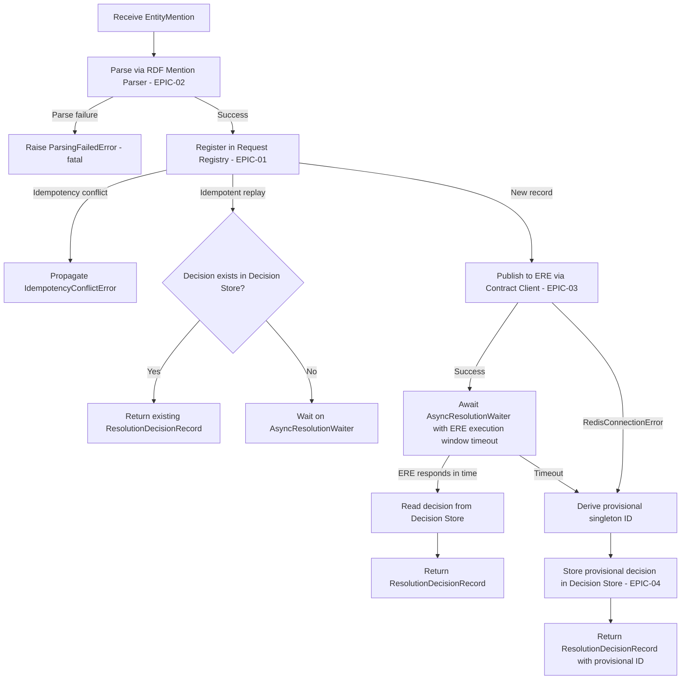

# Epic: ERS-EPIC-06 — Resolution Coordinator

## Status
- **Epic ID:** ERS-EPIC-06
- **Component:** #6 — Resolution Coordinator
- **Phase:** Planning
- **Spines:** A (Resolution Intake), B (Async Engine Interaction)
- **Last updated:** 2026-03-12
- **Dependencies:** EPIC-01 (Request Registry), EPIC-02 (RDF Mention Parser), EPIC-03 (ERE Contract Client), EPIC-04 (Resolution Decision Store)
- **Clarity Gate:** Score: 9.85/10

---

# Part 1 — Specification

**Document type:** Implementation

## 1. Description

The Resolution Coordinator is the **service-layer orchestrator** for Spines A and B. It receives entity mention resolution requests, coordinates registration (EPIC-01), parsing (EPIC-02), engine submission (EPIC-03), and decision persistence (EPIC-04), then returns a canonical or provisional cluster identifier to the caller within the client timeout budget.

This component is a pure **service** — it defines no new entrypoints (EPIC-07 provides the REST API) and no new adapters. It orchestrates existing adapters and services from dependency EPICs.

The Coordinator owns three critical responsibilities:

1. **Intake orchestration** — validate, parse, register, and publish each Entity Mention through the resolution pipeline
2. **Time budget enforcement** — manage dual timeouts (client budget and ERE execution window) and issue provisional identifiers on timeout
3. **Bulk decomposition** — break multi-mention requests into independent single-mention resolutions

The Coordinator does NOT:
- Make clustering decisions (ERE authority)
- Consume ERE responses directly (EPIC-05: ERE Result Integrator)
- Expose HTTP endpoints (EPIC-07: ERS REST API)
- Define new domain models (reuses er-spec and dependency EPIC models)

## 2. Glossary

| Term | Definition |
|------|-----------|
| **Correlation Triad** | `(source_id, request_id, entity_type)` — sole correlation and uniqueness key across ERS-ERE. |
| **Client Timeout Budget** | Maximum time ERS may spend before returning a response to the Originator. Configuration-driven, default 60s. |
| **ERE Execution Window** | Maximum time the Coordinator waits for an ERE response before issuing a provisional identifier. Must be < client budget. Configuration-driven. |
| **Provisional Singleton ID** | Deterministically derived cluster identifier: `SHA256(concat(source_id, request_id, entity_type))`. Issued when ERE does not respond within the execution window. |
| **Draft Identifier** | Synonym for Provisional Singleton ID. Used interchangeably in source architecture documents. |
| **AsyncResolutionWaiter** | In-process coordination component that manages `asyncio.Event` objects keyed by triad. Allows the Coordinator to await ERE responses signalled by EPIC-05. |
| **Idempotent Replay** | Resubmission of the same triad with identical content. Returns the existing decision from the Decision Store. |
| **Idempotency Conflict** | Resubmission of the same triad with different content. Rejected with explicit error. |
| **Bulk Decomposition** | Breaking a multi-mention request into independent single-mention resolutions executed concurrently. |
| **er-spec** | Shared library providing domain models used across ERS and ERE. |

## 3. Scope

### In Scope

- Service class `ResolutionCoordinatorService` orchestrating the full Spine A intake flow
- Dual time budget enforcement (client budget + ERE execution window)
- Provisional singleton ID derivation: `SHA256(concat(source_id, request_id, entity_type))`
- Bulk request decomposition into independent single-mention resolutions
- Idempotent replay handling (return existing decision from Decision Store)
- Idempotency conflict detection and rejection
- Integration with `AsyncResolutionWaiter` for in-process ERE response notification
- Outbound contract validation before publishing to ERE (triad completeness)
- Graceful degradation on Redis failure (issue provisional, persist in Decision Store)
- Configuration model for timeout values
- OpenTelemetry instrumentation at the service layer

### Out of Scope

- ERE response consumption and Decision Store updates from ERE outcomes (EPIC-05)
- REST API / HTTP entrypoints (EPIC-07)
- RDF parsing logic (EPIC-02 — Coordinator calls the parser service)
- Request Registry persistence internals (EPIC-01)
- Decision Store persistence internals (EPIC-04)
- ERE Contract Client transport internals (EPIC-03)
- Retry policies for ERE publishing (on failure, issue provisional)
- User-initiated curation flows (EPIC-09, Spine D)
- Authentication / authorisation

### Assumptions

1. All dependency services (EPIC-01 through EPIC-04) are available as injectable Python classes.
2. `AsyncResolutionWaiter` runs in the same process as the Coordinator (single-process deployment for MVP).
3. The er-spec library provides all domain models needed (`EntityMention`, `EntityMentionIdentifier`, `ClusterReference`, `EntityMentionResolutionRequest`).
4. EPIC-05 (ERE Result Integrator) writes to the Decision Store and then signals the `AsyncResolutionWaiter` via a callback. This coupling is the integration contract between EPIC-05 and EPIC-06.
5. Bulk requests are bounded in size (max items enforced at the API layer, EPIC-07).

## 4. Domain Models

All models are imported from er-spec or dependency EPICs. The Coordinator defines only a configuration model.

### 4.1 Models from Dependencies (used, not defined here)

| Model | Source | Used For |
|-------|--------|----------|
| `EntityMention` | er-spec | Input payload |
| `EntityMentionIdentifier` | er-spec | Triad correlation key |
| `ClusterReference` | er-spec | Cluster assignment (current + candidates) |
| `EntityMentionResolutionRequest` | er-spec | ERE publish envelope |
| `ResolutionRequestRecord` | EPIC-01 | Request Registry record |
| `JSONRepresentation` | EPIC-01 | Parsed mention content |
| `ResolutionDecisionRecord` | EPIC-04 | Decision Store record |

### 4.2 Local Configuration Model

```python
class CoordinatorConfig(BaseModel):
    """Configuration for the Resolution Coordinator timeouts."""
    client_timeout_seconds: float = 60.0
    ere_execution_window_seconds: float = 10.0

    @model_validator(mode="after")
    def execution_window_less_than_client_timeout(self) -> "CoordinatorConfig":
        if self.ere_execution_window_seconds >= self.client_timeout_seconds:
            raise ValueError(
                "ere_execution_window_seconds must be < client_timeout_seconds"
            )
        return self
```

**Constraints:**
- `client_timeout_seconds` must be > 0.
- `ere_execution_window_seconds` must be > 0 and strictly less than `client_timeout_seconds`.
- All values overridable via environment variables (prefix `ERS_COORDINATOR_`).

### 4.3 Local Exceptions

| Exception | Raised When |
|-----------|------------|
| `ResolutionTimeoutError` | Client timeout budget expired before any response could be produced. Fatal — propagated to caller (EPIC-07 maps to 504). |
| `ParsingFailedError` | RDF Mention Parser (EPIC-02) raises any parsing error. Fatal — request rejected, NOT registered in Request Registry. |
| `EnginePublishFailedError` | ERE Contract Client (EPIC-03) raises `RedisConnectionError`. Non-fatal — Coordinator issues provisional ID as graceful degradation. |

All exceptions inherit from a base `CoordinatorError`. Existing exceptions from dependencies (`IdempotencyConflictError` from EPIC-01, `StaleOutcomeError` from EPIC-04) are propagated, not wrapped.

## 5. Behavioural Specification

### 5.1 Single-Mention Resolution Flow



**Step-by-step algorithm:**

1. **Parse.** Call `RDFMentionParserService.parse(entity_mention)` → `JSONRepresentation`. If parsing fails, raise `ParsingFailedError`. Do NOT register the request.

2. **Register.** Call `RequestRegistryService.register_resolution_request(entity_mention)`.
   - If **idempotent replay** (same triad, same content): look up Decision Store. If a decision exists, return it immediately. If no decision yet (ERE hasn't responded), share the existing async wait (step 5).
   - If **idempotency conflict** (same triad, different content): propagate `IdempotencyConflictError` to caller. Do NOT touch Decision Store.
   - If **new record**: proceed to step 3.

3. **Publish to ERE.** Construct `EntityMentionResolutionRequest` with triad + entity mention. Call `EREPublishService.publish_request(request)`.
   - If `RedisConnectionError` (Redis down): skip to step 6 (graceful degradation — issue provisional).
   - If success: proceed to step 4.

4. **Register/get wait handle.** Call `AsyncResolutionWaiter.get_or_create(triad_key)` → returns an `asyncio.Event`.

5. **Await ERE response.** `await event.wait()` with timeout = `ere_execution_window_seconds`.
   - If **event fires** (EPIC-05 signalled): proceed to step 7.
   - If **timeout**: proceed to step 6.

6. **Issue provisional singleton.**
   - Derive: `cluster_id = SHA256(concat(source_id, request_id, entity_type))` as hex string.
   - Construct `ClusterReference(cluster_id=provisional_id, confidence_score=1.0, similarity_score=1.0)`.
   - Call `DecisionStoreService.store_decision(identifier, current=provisional_ref, candidates=[provisional_ref], updated_at=now_utc)`.
   - Return the `ResolutionDecisionRecord`.

7. **Read authoritative decision.** Call `DecisionStoreService.get_decision_by_triad(identifier)`. Return the `ResolutionDecisionRecord`.

8. **Cleanup.** After returning, `AsyncResolutionWaiter.release(triad_key)` decrements the waiter count and removes the Event when no more waiters remain.

### 5.2 Bulk Decomposition

```python
async def resolve_bulk(
    self,
    entity_mentions: list[EntityMention],
) -> list[ResolutionDecisionRecord | CoordinatorError]:
```

- Decompose the list into independent `resolve_single()` calls.
- Execute concurrently via `asyncio.gather(*tasks, return_exceptions=True)`.
- Each mention has its own ERE execution window timeout.
- The overall operation is bounded by the client timeout budget.
- Return a list of results in the same order as the input. Failures are returned as error objects (not raised), so one failing mention does not abort the batch.

### 5.3 AsyncResolutionWaiter Specification

```python
class AsyncResolutionWaiter:
    """In-process coordination between Coordinator (waiter) and
    Result Integrator (signaller) using asyncio.Event objects."""

    def __init__(self) -> None:
        self._events: dict[str, asyncio.Event] = {}
        self._waiter_counts: dict[str, int] = {}
        self._lock: asyncio.Lock = asyncio.Lock()

    async def get_or_create(self, triad_key: str) -> asyncio.Event:
        """Get or create an Event for a triad. Increments waiter count.
        Multiple callers with the same triad_key share one Event."""

    async def notify(self, triad_key: str) -> None:
        """Called by EPIC-05 after writing to Decision Store.
        Sets the Event, waking all waiters for this triad."""

    async def release(self, triad_key: str) -> None:
        """Decrements waiter count. Removes Event when count reaches 0."""
```

- `triad_key` is a string: `f"{source_id}|{request_id}|{entity_type}"`.
- Thread-safe via `asyncio.Lock`.
- The `notify` method is the **integration contract** with EPIC-05. EPIC-05 calls `waiter.notify(triad_key)` after writing the ERE outcome to the Decision Store.
- Events are ephemeral (in-memory only). On process restart, pending waits are lost — this is acceptable because the client request will have already timed out.

### 5.4 Provisional Singleton ID Derivation

```python
import hashlib

def derive_provisional_cluster_id(identifier: EntityMentionIdentifier) -> str:
    """Deterministic provisional singleton cluster ID.
    Algorithm: SHA256(concat(source_id, request_id, entity_type)) as hex string.
    Both ERS and ERE implement the same derivation rule (ADR-A1N)."""
    raw = f"{identifier.source_id}{identifier.request_id}{identifier.entity_type}"
    return hashlib.sha256(raw.encode("utf-8")).hexdigest()
```

- Pure function, no I/O, no side effects.
- Deterministic: same input always produces the same ID.
- Defined as a module-level utility in the Coordinator's service module.

## 6. Error Handling Matrix

| Error Type | Detection | Response | Fallback | Logging Level |
|------------|-----------|----------|----------|---------------|
| RDF parsing failure (any EPIC-02 error) | Parser raises exception | Raise `ParsingFailedError` wrapping original | None — request NOT registered | ERROR |
| Idempotency conflict | EPIC-01 raises `IdempotencyConflictError` | Propagate to caller (EPIC-07 maps to 422) | None | WARN |
| Redis connection failure | EPIC-03 raises `RedisConnectionError` | Issue provisional singleton ID | Persist provisional in Decision Store | WARN |
| ERE execution window timeout | `asyncio.Event.wait()` times out | Issue provisional singleton ID | Persist provisional in Decision Store | INFO |
| Client timeout budget exceeded | Overall operation exceeds `client_timeout_seconds` | Raise `ResolutionTimeoutError` | None — propagate to caller (EPIC-07 maps to 504) | ERROR |
| Decision Store unavailable (MongoDB down) | EPIC-04 raises `RepositoryConnectionError` | Raise `ResolutionTimeoutError` (fatal — cannot persist) | None | ERROR |
| Stale outcome on provisional write | EPIC-04 raises `StaleOutcomeError` | Ignore — means ERE already wrote a newer decision | Read and return the existing decision | DEBUG |
| Bulk: individual mention failure | Any error in single-mention flow | Capture as error in results list | Other mentions unaffected | Per error type |

---

## 7. Anti-Patterns (DO NOT)

| Don't | Do Instead | Why |
|-------|-----------|-----|
| Override or reinterpret ERE clustering decisions in the Coordinator | Accept ERE outcomes as-is; store exactly what ERE returns | ERE is the canonical authority for clustering. ERS must never override. |
| Implement retry logic for ERE publishing inside the Coordinator | On publish failure, issue provisional singleton and persist in Decision Store | Retries add complexity and latency. Graceful degradation is simpler and meets the user's requirement. |
| Register a request in the Request Registry before parsing succeeds | Parse first, then register. Parsing failure = fatal, request never existed. | Avoids polluting the registry with requests that could not be processed. |
| Put parsing, registration, or publishing logic inside the `AsyncResolutionWaiter` | Keep the waiter as a pure coordination primitive (Events only). All business logic stays in `ResolutionCoordinatorService`. | SRP: waiter coordinates; service orchestrates. |
| Use polling loops to check the Decision Store for ERE responses | Use `asyncio.Event` signalled by EPIC-05's callback | Polling wastes CPU and adds latency. Event-driven is simpler and faster. |
| Catch and swallow `IdempotencyConflictError` | Propagate to caller. The API layer (EPIC-07) maps it to 422. | Conflicts are business errors that the caller must handle. |
| Log raw `entity_mention.content` (RDF payload) | Log only triad fields + operation outcome + timing | PII risk and payload size. Same constraint as EPIC-02 and EPIC-03. |
| Put OpenTelemetry spans or logging inside `AsyncResolutionWaiter` or utility functions | Keep all observability in `ResolutionCoordinatorService` methods | Architectural constraint: observability at service level only. |
| Create new Pydantic models duplicating er-spec or dependency EPIC models | Import and reuse existing models | Architectural constraint #10: reuse er-spec models exclusively. |
| Use external coordination (Celery, Redis pub/sub) for the waiter in MVP | Use in-process `asyncio.Event`. Evolve to Redis Pub/Sub only if horizontal scaling requires it. | Simplicity and zero external dependencies for coordination. |

---

## 8. Test Case Specifications

### Unit Tests

| Test ID | Component | Input | Expected Output | Edge Cases |
|---------|-----------|-------|-----------------|------------|
| TC-001 | `CoordinatorConfig` | Default constructor | Valid: 60s client, 10s ERE window | N/A |
| TC-002 | `CoordinatorConfig` | `ere_execution_window_seconds=60, client_timeout_seconds=60` | `ValidationError` (window must be < budget) | Window = budget (equal, not less) |
| TC-003 | `CoordinatorConfig` | `client_timeout_seconds=0` | `ValidationError` | Negative values |
| TC-004 | `derive_provisional_cluster_id` | Known triad | Deterministic SHA-256 hex string | Empty source_id; unicode characters in fields |
| TC-005 | `derive_provisional_cluster_id` | Same triad twice | Identical output both times | Different triads produce different IDs |
| TC-006 | `AsyncResolutionWaiter.get_or_create` | New triad_key | New Event created, waiter count = 1 | Same key called twice → same Event, count = 2 |
| TC-007 | `AsyncResolutionWaiter.notify` | Triad with waiting Event | Event is set; all waiters unblocked | Notify on non-existent key → no-op |
| TC-008 | `AsyncResolutionWaiter.release` | Triad with count = 1 | Event removed from dict | Count > 1 → decremented but not removed |
| TC-009 | Service: resolve_single (happy path) | Valid EntityMention, ERE responds in time | `ResolutionDecisionRecord` with ERE cluster ID | N/A |
| TC-010 | Service: resolve_single (ERE timeout) | Valid EntityMention, ERE does NOT respond in time | `ResolutionDecisionRecord` with provisional singleton ID | Provisional ID matches SHA-256 derivation |
| TC-011 | Service: resolve_single (idempotent replay, decision exists) | Same triad + same content, decision in store | Returns existing `ResolutionDecisionRecord` | No ERE publish, no new registration |
| TC-012 | Service: resolve_single (idempotent replay, no decision yet) | Same triad + same content, no decision yet | Shares async wait with original request | Both waiters unblocked when EPIC-05 signals |
| TC-013 | Service: resolve_single (idempotency conflict) | Same triad, different content | `IdempotencyConflictError` propagated | Decision Store not touched |
| TC-014 | Service: resolve_single (parse failure) | Malformed RDF content | `ParsingFailedError` raised | Request NOT registered in Request Registry |
| TC-015 | Service: resolve_single (Redis down) | Valid mention, Redis connection fails | Provisional singleton issued and persisted | No ERE publish attempted after failure |
| TC-016 | Service: resolve_single (MongoDB down) | Valid mention, Decision Store unavailable | `ResolutionTimeoutError` raised (fatal) | N/A |
| TC-017 | Service: resolve_single (stale outcome on provisional write) | ERE wrote decision before provisional | Reads and returns existing (newer) decision | `StaleOutcomeError` caught, not propagated |
| TC-018 | Service: resolve_bulk | 3 mentions, 2 succeed, 1 parse failure | List of 2 decisions + 1 error | Order preserved; failures don't abort batch |
| TC-019 | Service: resolve_bulk | Empty list | Empty list returned | N/A |
| TC-020 | Service: observability | Valid resolve | OTel span with triad attributes + timing | Error case: span records exception |

### Integration Tests

| Test ID | Flow | Setup | Verification | Teardown |
|---------|------|-------|--------------|----------|
| IT-001 | Full happy path | MongoDB + Redis running; all dependency services wired | Submit mention → ERE response simulated → decision returned with ERE cluster ID | Drop test collections; flush Redis |
| IT-002 | Timeout → provisional | MongoDB + Redis; ERE does NOT respond | Submit mention → provisional singleton returned; Decision Store contains provisional | Drop test collections; flush Redis |
| IT-003 | Redis down → provisional | MongoDB running; Redis NOT running | Submit mention → provisional returned; Decision Store contains provisional | Drop test collections |
| IT-004 | Idempotent replay | MongoDB + Redis; pre-existing decision | Submit same triad+content → same decision returned without new ERE publish | Drop test collections |
| IT-005 | Concurrent identical requests | MongoDB + Redis | Submit 5 identical requests concurrently → all 5 return same decision; exactly 1 ERE publish | Drop test collections; flush Redis |
| IT-006 | Bulk decomposition | MongoDB + Redis | Submit 3 mentions → 3 independent decisions returned | Drop test collections; flush Redis |

---

## 9. Task Breakdown

### Task 1: Define Configuration and Exceptions
**Layer:** `models/`
**Dependencies:** None
**Description:**
- Create `CoordinatorConfig` Pydantic model with field validators.
- Create exception hierarchy: `CoordinatorError` (base), `ResolutionTimeoutError`, `ParsingFailedError`, `EnginePublishFailedError`.
- Environment variable loading via Pydantic `model_config` with `env_prefix = "ERS_COORDINATOR_"`.

**Acceptance Criteria:**
- `CoordinatorConfig()` produces valid defaults (60s / 10s).
- Invalid configs rejected (window >= budget, zero/negative values).
- All exceptions instantiable with message string and inherit from `CoordinatorError`.

### Task 2: Implement AsyncResolutionWaiter
**Layer:** `services/` (internal coordination component)
**Dependencies:** None
**Description:**
- Create `AsyncResolutionWaiter` class with `get_or_create`, `notify`, `release` methods.
- Thread-safe via `asyncio.Lock`.
- Full unit test coverage including concurrent access scenarios.

**Acceptance Criteria:**
- Multiple callers with same triad share one Event.
- `notify` unblocks all waiters.
- `release` cleans up when waiter count reaches 0.
- Notify on non-existent key is a no-op.

### Task 3: Implement Provisional ID Derivation
**Layer:** `services/` (module-level utility)
**Dependencies:** er-spec (`EntityMentionIdentifier`)
**Description:**
- Pure function `derive_provisional_cluster_id(identifier) -> str`.
- SHA-256 of `concat(source_id, request_id, entity_type)`.

**Acceptance Criteria:**
- Deterministic (same input → same output).
- Matches the algorithm specified in ADR-A1N and EPIC-04.

### Task 4: Implement ResolutionCoordinatorService
**Layer:** `services/`
**Dependencies:** Tasks 1-3, EPIC-01 service, EPIC-02 service, EPIC-03 service, EPIC-04 service
**Description:**
- Create `ResolutionCoordinatorService` with constructor accepting all dependency services + `AsyncResolutionWaiter` + `CoordinatorConfig`.
- Implement `resolve_single(entity_mention: EntityMention) -> ResolutionDecisionRecord`.
- Implement `resolve_bulk(entity_mentions: list[EntityMention]) -> list[ResolutionDecisionRecord | CoordinatorError]`.
- Full flow per Section 5.1 algorithm.
- OpenTelemetry spans on `resolve_single` and `resolve_bulk`.

**Acceptance Criteria:**
- Happy path: ERE responds in time → returns ERE decision.
- Timeout: provisional singleton issued and persisted.
- Redis down: graceful degradation → provisional.
- MongoDB down: fatal error.
- Idempotent replay: returns existing decision.
- Conflict: propagated.
- Parse failure: fatal, no registration.
- Bulk: concurrent execution, order preserved, individual failures captured.

### Task 5: Unit Tests
**Layer:** `tests/`
**Dependencies:** Tasks 1-4
**Description:**
- Unit tests for all components using mocked dependency services.
- All TC-001 through TC-020 from Section 8.
- Minimum 90% coverage on new code.

**Acceptance Criteria:**
- All test cases pass.
- Coverage >= 90%.

### Task 6: Integration Tests
**Layer:** `tests/`
**Dependencies:** Tasks 1-4, MongoDB + Redis available
**Description:**
- Integration tests with real MongoDB and Redis (via testcontainers or docker-compose).
- All IT-001 through IT-006 from Section 8.
- Simulated ERE responses via direct Redis `lpush` to `ere_responses`.

**Acceptance Criteria:**
- All integration tests pass.
- Tests are skippable if infrastructure unavailable (pytest marks).

### Task 7: Gherkin Features
**Layer:** `tests/features/`
**Dependencies:** Tasks 1-4
**Description:**
- Feature files per Section 11.
- Step definitions calling the Coordinator service.

**Acceptance Criteria:**
- All Gherkin scenarios pass via pytest-bdd.

## Roadmap
- [ ] Task 1: Define Configuration and Exceptions (models)
- [ ] Task 2: Implement AsyncResolutionWaiter (services)
- [ ] Task 3: Implement Provisional ID Derivation (services)
- [ ] Task 4: Implement ResolutionCoordinatorService (services)
- [ ] Task 5: Unit Tests (tests)
- [ ] Task 6: Integration Tests (tests)
- [ ] Task 7: Gherkin Features (tests/features)

---

## 10. Architectural Constraints

1. **ERE Authority:** The Coordinator must never override, reinterpret, or derive canonical identifiers independently. Provisional IDs are explicitly temporary placeholders.
2. **Triad Correlation:** All operations keyed on `(source_id, request_id, entity_type)`. No surrogate keys.
3. **Decision Store Atomicity:** Provisional write uses EPIC-04's atomic upsert with staleness detection. If ERE already wrote a newer decision, `StaleOutcomeError` is caught and the existing decision is returned.
4. **At-Least-Once Tolerance:** The Coordinator may publish the same request more than once (e.g., on retry after partial failure). ERE and EPIC-05 must be idempotent.
5. **Provisional Identifier Lifecycle:** Deterministically derived; stored as a normal `ClusterReference` in the Decision Store. ERE may confirm or replace it.
6. **Observability at Service Level:** OTel spans and structured logs only in `ResolutionCoordinatorService`. Not in `AsyncResolutionWaiter`, utility functions, or dependency calls.
7. **Layered Architecture:** `entrypoints` → `services` → `models`, `adapters` → `models`. The Coordinator is a service — it does not import from entrypoints and is not imported by models or adapters.
8. **Reuse er-spec Models:** Only `CoordinatorConfig` and exceptions defined locally. All domain models from er-spec and dependency EPICs.
9. **No External Coordination Dependencies:** `AsyncResolutionWaiter` uses in-process `asyncio.Event`. No Celery, no Redis pub/sub, no external message broker for coordination.

---

## 11. Gherkin Feature Outline

At `tests/features/resolution_coordinator/`:

### Feature: Resolve Single Entity Mention

| Scenario | Description |
|----------|-------------|
| Happy path — ERE responds within execution window | Mention parsed, registered, published to ERE; ERE responds; authoritative decision returned |
| ERE timeout — provisional singleton issued | Mention parsed, registered, published; ERE does not respond; provisional ID derived and persisted; returned to caller |
| Idempotent replay with existing decision | Same triad + same content submitted again; existing decision returned without new ERE publish |
| Idempotent replay with pending resolution | Same triad + same content; first request still waiting for ERE; second request shares the wait |
| Idempotency conflict | Same triad, different content → error raised, Decision Store untouched |
| Parse failure | Malformed RDF → error raised, request NOT registered |
| Redis down — graceful degradation | Redis unavailable → provisional singleton issued and persisted in Decision Store |
| MongoDB down — fatal error | Decision Store unavailable → fatal error raised |
| Stale outcome on provisional write | ERE already wrote decision before provisional → existing decision returned |

### Feature: Resolve Bulk Entity Mentions

| Scenario | Description |
|----------|-------------|
| All mentions succeed | N mentions → N independent decisions returned in order |
| Partial failure | Some mentions fail parsing; others succeed; results list contains both decisions and errors |
| Empty list | Zero mentions → empty list returned |

### Feature: AsyncResolutionWaiter Coordination

| Scenario | Description |
|----------|-------------|
| Single waiter notified | One waiter registered, EPIC-05 signals → waiter unblocked |
| Multiple waiters share event | Two waiters on same triad, EPIC-05 signals → both unblocked |
| Waiter timeout | Waiter registered, no signal within timeout → waiter unblocked by timeout |
| Cleanup after all waiters release | All waiters release → Event removed from dictionary |

---

## 12. Risks and Assumptions

### Risks

| Risk | Impact | Mitigation |
|------|--------|-----------|
| EPIC-05 not yet implemented — `AsyncResolutionWaiter.notify` never called | HIGH — all resolutions timeout to provisional | Implement EPIC-05 promptly; integration tests simulate EPIC-05 by calling `notify` directly |
| Process crash loses in-memory Events | MEDIUM — pending waits lost | Acceptable: client requests will have already timed out. Decision Store is the source of truth. |
| Bulk requests with many mentions exhaust asyncio event loop | LOW — hundreds of concurrent tasks | Bound concurrency with `asyncio.Semaphore` in `resolve_bulk` if needed |
| Race between provisional write and ERE outcome | LOW — both try to write Decision Store | EPIC-04's staleness detection handles this atomically. `StaleOutcomeError` caught. |
| er-spec model changes break Coordinator | MEDIUM — all dependency EPICs affected | Pin er-spec version; integration tests on upgrade |

### Assumptions

1. EPIC-05 (ERE Result Integrator) will call `AsyncResolutionWaiter.notify(triad_key)` after writing ERE outcomes to the Decision Store.
2. Single-process deployment for MVP. Horizontal scaling (multiple Coordinator instances) would require replacing `AsyncResolutionWaiter` with Redis Pub/Sub or similar.
3. The client timeout budget is enforced at the HTTP layer (EPIC-07) via request timeouts. The Coordinator's `client_timeout_seconds` is a safety net.
4. Bulk request size is bounded at the API layer (EPIC-07). The Coordinator does not enforce a max size.

---

## 13. Dependencies and Integration Points

| Dependency | Type | Provides | Epic |
|-----------|------|----------|------|
| `RequestRegistryService` | Service (injected) | `register_resolution_request()`, idempotency enforcement | EPIC-01 |
| `RDFMentionParserService` | Service (injected) | `parse(entity_mention)` → `JSONRepresentation` | EPIC-02 |
| `EREPublishService` | Service (injected) | `publish_request(request)` → `ere_request_id` | EPIC-03 |
| `DecisionStoreService` | Service (injected) | `store_decision()`, `get_decision_by_triad()` | EPIC-04 |
| `AsyncResolutionWaiter` | Component (injected) | In-process event coordination | This EPIC |
| `CoordinatorConfig` | Configuration | Timeout values | This EPIC |
| er-spec | Library | Domain models | External |

### Downstream Consumers

| Consumer | What It Uses | Epic |
|----------|-------------|------|
| ERS REST API | `ResolutionCoordinatorService.resolve_single()`, `resolve_bulk()` | EPIC-07 |
| ERE Result Integrator | `AsyncResolutionWaiter.notify()` callback | EPIC-05 |

---

## 14. References

| Topic | Location | Section |
|-------|----------|---------|
| Spine A: Resolution Intake | `docs/modules/ROOT/pages/ERSArchitecture/spine-a.adoc` | Full section — dual time budgets, provisional ID flow |
| Spine B: Async Engine Interaction | `docs/modules/ROOT/pages/ERSArchitecture/spine-b.adoc` | Full section — request publication, outcome integration |
| UC-W1: Resolve Entity Mention | `docs/modules/ROOT/pages/AnnexeB-UseCases/ucw1.adoc` | Full section — work shape guarantees |
| UC-B1.1: Resolve via ERS API | `docs/modules/ROOT/pages/AnnexeB-UseCases/ucb11.adoc` | Full section — detailed behaviour |
| UC-B1.2: Integrate ERE Outcomes | `docs/modules/ROOT/pages/AnnexeB-UseCases/ucb12.adoc` | Full section — outcome types and update rules |
| ADR-A1N: Provisional Singleton Derivation | `docs/modules/ROOT/pages/AnnexeA-ADRs/adra1.adoc` | SHA-256 derivation algorithm |
| Request Registry EPIC | `.claude/memory/epics/ers-epic-01-request-registry/EPIC.md` | Service interface, idempotency algorithm |
| RDF Mention Parser EPIC | `.claude/memory/epics/ers-epic-02-rdf-mention-parser/EPIC.md` | Parser service interface, error types |
| ERE Contract Client EPIC | `.claude/memory/epics/ers-epic-03-ere-contract-client/EPIC.md` | Publish service interface, error types |
| Resolution Decision Store EPIC | `.claude/memory/epics/ers-epic-04-resolution-decision-store/EPIC.md` | Decision Store service interface, staleness detection |
| Planning Roadmap | `.claude/memory/planning-roadmap.md` | Component #6 |

---
<!-- implementation-log -->
---

# Part 2 — Implementation Log

<!-- Written and updated by the implementer during Phase 3. -->

---

## Clarity Gate Assessment

**Document type:** Implementation | **Date:** 2026-03-12

### 13-Item Checklist

#### Foundation Checks
- [x] **Actionable** — Concrete service interface, step-by-step algorithm with Mermaid diagram, configuration model with validators, utility function with code.
- [x] **Current** — Reflects developer answers from 2026-03-12 Q&A session. All design decisions documented.
- [x] **Single Source** — er-spec and dependency EPIC models referenced by pointer only (Section 4.1). Config and exceptions defined locally (Sections 4.2-4.3).
- [x] **Decision, Not Wish** — All decided: asyncio.Event coordination, SHA-256 provisional derivation, graceful degradation on Redis failure, fatal on MongoDB failure, bulk decomposition in Coordinator.
- [x] **Prompt-Ready** — Every section provides direct implementer input: interfaces, algorithms, config constraints, error handling matrix, test cases.
- [x] **No Future State** — No "might", "eventually", "ideally". Horizontal scaling noted as future evolution with explicit boundary (Assumption #2).
- [x] **No Fluff** — Pure specification. No motivational content.

#### Document Architecture Checks
- [x] **Type Identified** — Implementation (stated after Part 1 heading).
- [x] **Anti-patterns Placed** — Section 7, 10 entries (exceeds minimum of 5).
- [x] **Test Cases Placed** — Section 8, 20 unit tests + 6 integration tests.
- [x] **Error Handling Placed** — Section 6, 8 error scenarios with detection, response, fallback, and log level.
- [x] **Deep Links Present** — Section 14, 11 references with file paths and section context.
- [x] **No Duplicates** — Dependency models listed as reference table; not redefined.

### Scoring

| Criterion | Weight | Score | Rationale |
|-----------|--------|-------|-----------|
| Actionability | 25% | 10 | Step-by-step algorithm, Mermaid flow, concrete service methods, code for utility and waiter |
| Specificity | 20% | 10 | Timeout defaults explicit (60s/10s), SHA-256 algorithm specified, all error types with handling |
| Consistency | 15% | 10 | Single source for config; all models by pointer; no duplication across EPIC boundaries |
| Structure | 15% | 10 | Tables throughout; numbered algorithm; clear task breakdown with layers and acceptance criteria |
| Disambiguation | 15% | 10 | 10 anti-patterns; 8 error scenarios; edge cases per test; concurrent access addressed |
| Reference Clarity | 10% | 9 | 11 deep links. Minor gap: ADR-A1N file path assumed (not verified against actual docs directory structure) |

**Score: 9.85/10** — Weighted: (10×0.25 + 10×0.20 + 10×0.15 + 10×0.15 + 10×0.15 + 9×0.10) = 9.85. Rounded to **9.8/10** — PASS. Ready for implementation.
