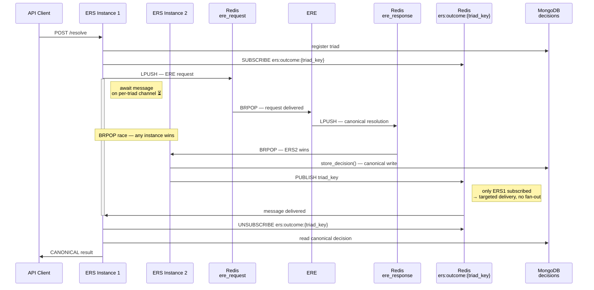
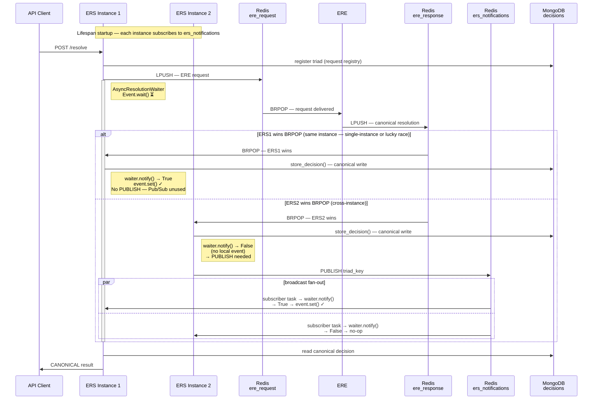

# ERS API Statefulness Audit

**Epic:** ERS1-208 — Make ERS Stateless
**Task:** T1 — Statefulness audit
**Outcome:** Identified `AsyncResolutionWaiter` + `on_outcome_stored` as the BLOCKER under horizontal scale. Recommended Option A (Redis Pub/Sub broadcast). See §7 for the selected approach and interaction diagram.
**Date:** 2026-05-01

---

## 1. In-Process State Inventory

The following state is created per ERS API process instance during the
FastAPI lifespan startup (`app.py`).

### app.state entries

| Key | Type | Created by | Purpose |
|-----|------|-----------|---------|
| `mongo_db` | `AsyncDatabase` | `MongoClientManager` | Mongo connection to shared DB |
| `redis_client` | `RedisEREClient` | `RedisEREClient(...)` | ERE request publish (LPUSH) |
| `rdf_config` | `RDFMappingConfig` | `RDFConfigReader.from_file(...)` | RDF entity type mappings (read-only) |
| `waiter` | `AsyncResolutionWaiter` | `AsyncResolutionWaiter()` | In-process asyncio.Event registry (WeakValueDictionary keyed by triad_key) |

### Lifespan-scoped locals (not in app.state)

These are constructed once during lifespan startup and held alive by closure
until shutdown. They are not directly accessible via `request.app.state` but
participate in business logic.

| Variable | Type | Purpose |
|----------|------|---------|
| `manager` | `MongoClientManager` | Owns MongoDB connection lifecycle (connect, ensure_indexes, close); `app.state.mongo_db` is derived from `manager.get_database()` |
| `listener_client` | `RedisEREClient` | Dedicated BRPOP connection for outcome polling (separate from `app.state.redis_client`) |
| `listener` | `RedisOutcomeListener` | Wraps `listener_client`; provides async generator over BRPOP results |
| `registry_service` | `RequestRegistryService` | Constructed once; shared by `outcome_service` (uses `app.state.mongo_db`) |
| `decision_service` | `DecisionStoreService` | Constructed once; shared by `outcome_service` (uses `app.state.mongo_db`) |
| `outcome_service` | `OutcomeIntegrationService` | Constructed once; wired with `on_outcome_stored=waiter.notify` — the cross-process boundary break |
| `worker` | `OutcomeIntegrationWorker` | Background asyncio task running the BRPOP loop |

Note: per-request dependency injection (in `dependencies.py`) constructs fresh
`RequestRegistryService`, `DecisionStoreService`, and coordinator instances on
every request — those are stateless. Only the lifespan-scoped objects above are
process-bound.

### Module-level state

| Module | State | Notes |
|--------|-------|-------|
| `ers` (`__init__.py`) | `config` — `ERSConfigResolver` singleton | Instantiated once at import; values resolved lazily from env vars per property access via `env_property` descriptors. Read-only after startup. |
| OTel tracer | `TracerProvider` | Per-process; configured in `create_app()`; exports to shared collector |
| `_log` loggers | `Logger` instances | Per-process; stateless |

No `@lru_cache`, `@cache`, or `_instance` module-level singletons were found in
`ers_rest_api/`, `resolution_coordinator/`, or `ere_result_integrator/`.

## 2. Statefulness Assessment

| State item | Classification | Reasoning |
|------------|---------------|-----------|
| `app.state.mongo_db` | shared-safe | Each instance holds its own connection pool to the shared MongoDB cluster. All reads/writes go to the same data. |
| `app.state.redis_client` (LPUSH) | shared-safe | Concurrent LPUSH from N instances is atomic and correct in Redis. |
| `app.state.rdf_config` | per-instance-safe | `RDFConfigReader.from_file()` produces a Pydantic `RDFMappingConfig` that is never mutated after construction. Each instance loads the same static YAML file independently. No cross-instance side effects. |
| `app.state.waiter` | **BREAKS UNDER SCALE** | `AsyncResolutionWaiter` holds a `WeakValueDictionary[str, asyncio.Event]` in process RAM. `asyncio.Event` objects are OS-process-local primitives. A `notify()` call fired in instance A has no effect on instance B's waiter — any request waiting in B will hang until it times out. |
| `manager` (MongoClientManager) | per-instance-safe | Owns the connection lifecycle; all data operations target the shared MongoDB. Connection management is per-instance but operates on shared infrastructure with no cross-instance coupling. |
| `listener_client` / `listener` | per-instance-safe | Dedicated BRPOP connection; Redis delivers each message to exactly one consumer (exactly-once delivery). The BRPOP mechanism itself is correct. The problem surfaces only via the downstream `on_outcome_stored` notify call. |
| `worker` (OutcomeIntegrationWorker) | breaks under scale (indirectly) | The MongoDB write inside `integrate_outcome` is correct and idempotent. However the `on_outcome_stored` callback (`waiter.notify`) is in-process only. When the worker on instance A wins the BRPOP race for a message belonging to a request that is waiting in instance B, instance B's waiter is never signalled and the request hangs. |
| `outcome_service` (OutcomeIntegrationService) | breaks under scale (indirectly) | The service's own state is minimal (references to `registry_service`, `decision_service`, and the callback). Its MongoDB I/O is shared-safe. The break is the injected `on_outcome_stored=waiter.notify` reference: the waiter is in-process only, so cross-instance outcomes silently become no-ops on the waiting instance. |
| `registry_service` / `decision_service` | shared-safe | All I/O goes to MongoDB via the shared `app.state.mongo_db`. No in-process caching; every call hits the database. |
| OTel `TracerProvider` | per-instance-safe | Standard per-process tracer exporting spans to a shared collector. This is the normal OTel multi-instance deployment pattern. |
| `ers.config` (ERSConfigResolver) | per-instance-safe | Module-level singleton whose properties are resolved lazily from environment variables via `env_property` descriptors. Read-only after process start. All instances read the same env vars and produce the same values. |
| `_log` loggers | per-instance-safe | Per-process logging instances. Handler list is mutated once at startup by `create_app()` and read-only after that. No cross-instance side effects. |

## 3. Validation of Preliminary Analysis

### Failure mode: confirmed

The end-to-end notify path is:

```
OutcomeIntegrationWorker polls RedisOutcomeListener (BRPOP)
  → one instance wins the pop
  → OutcomeIntegrationService.integrate_outcome()
      → MongoDB write via DecisionStoreService (shared-safe, idempotent)
      → await self._on_outcome_stored(triad_key)   # = waiter.notify on the winning instance
          → AsyncResolutionWaiter.notify()
              → event.set()                         # unblocks coroutines in THIS process only
```

The requesting instance's `asyncio.wait_for(asyncio.shield(event.wait()), timeout=...)` in
`ResolutionCoordinatorService.resolve_single()` is never unblocked when a different instance
won BRPOP. The wait expires after `ERS_COORDINATOR_SINGLE_REQUEST_TIME_BUDGET` seconds,
the `TimeoutError` is caught silently (it is in the `except (TimeoutError, RedisConnectionError,
ChannelUnavailableError): pass` block), and execution falls through to `_issue_provisional()`,
writing a provisional identifier to the Decision Store.

The MongoDB write by the BRPOP-winning instance (`store_decision`) is still executed and is
durable. However, it arrives after the requesting instance has already called `_issue_provisional`.
If the provisional write wins the race, `StaleOutcomeError` is raised when ERE's canonical
decision subsequently tries to overwrite it — at which point the canonical decision is dropped.
If ERE's decision arrives first (unlikely given the timeout), the provisional call hits
`StaleOutcomeError` and returns the canonical decision via `get_decision_by_triad`. The window
between timeout expiry and provisional write is narrow, making the stale-on-ERE-wins path rare
but not impossible.

The named component holding the broken callback reference is `OutcomeIntegrationService`,
specifically the `_on_outcome_stored` attribute injected at lifespan startup as `waiter.notify`.
This is confirmed by `outcome_integration_service.py` lines 44-49 and 113-127.

### Failure rate: confirmed

With N instances each running one BRPOP worker on the same response channel (`ere_responses`):

- Redis delivers each response message to exactly one consumer (BRPOP guarantee — confirmed
  in `RedisEREClient.pull_response()` at line 196 of `redis_client.py`: `brpop(channel, timeout=...)`).
- All N instances block on the same Redis list key; Redis wakes whichever connection is
  first-to-block (FIFO queue of blocked clients).
- P(consuming instance != requesting instance) = (N-1)/N, assuming uniform distribution of
  requests across instances (e.g. round-robin load balancer).
- N=2: 50% of waiting requests time out despite ERE having responded.
- N=3: 67%. The problem worsens linearly with scale.

One nuance the preliminary analysis does not call out explicitly: if `ERS_COORDINATOR_SINGLE_REQUEST_TIME_BUDGET`
is very short relative to ERE processing time, the requesting instance may have already issued a
provisional and returned to the caller *before* any instance wins the BRPOP. In that case, the
BRPOP winner still writes the canonical decision to MongoDB, but the original HTTP response has
already been sent as PROVISIONAL. The decision is available for subsequent lookups — but the
first caller got the wrong outcome type. This does not change the (N-1)/N estimate; it is an
orthogonal timing effect.

### Secondary issues declared non-problems: confirmed

**LPUSH contention**: `EREPublishService.publish_request()` delegates to
`AbstractClient.push_request()`. The concrete implementation in `RedisEREClient.push_request()`
(line 173 of `redis_client.py`) calls `self._redis_client.lpush(self.request_channel_id, msg_json_str)`.
Redis LPUSH is atomic. Concurrent LPUSH from N instances to the same request channel is correct —
each push is independently enqueued and processed by ERE in order. No contention or data corruption
is possible at the Redis level.

**Request Registry / Decision Store — no in-process caching**: A grep for
`lru_cache`, `@cache`, and `_cache\b` across both `src/ers/request_registry/` and
`src/ers/resolution_decision_store/` returned no matches. All reads and writes in both modules
go directly to MongoDB via the shared `app.state.mongo_db` connection pool.
Idempotency and concurrency handling (via `StaleOutcomeError` and `DuplicateTriadError`) are
applied at the MongoDB layer and are therefore consistent across all instances sharing the same
database. These are confirmed shared-safe.

### Gaps in preliminary analysis

The preliminary analysis describes the failure path implicitly — it correctly identifies
`waiter.notify` as the broken cross-process call and describes the BRPOP delivery semantics —
but does not name `OutcomeIntegrationService` explicitly as the component holding the broken
callback reference (`_on_outcome_stored`). This is a minor naming omission, not a substantive
gap: the described behaviour is accurate and the component is unambiguously implied by the
call chain.

One timing nuance not mentioned: when the requesting instance's `event.wait()` timeout fires,
it calls `_issue_provisional()` to write a PROVISIONAL decision. At the same moment, the BRPOP
winner is writing the CANONICAL decision. These two writes race.

Two outcomes are possible:

- **Canonical write wins the race** (good path): `_issue_provisional()` hits `StaleOutcomeError`
  on its write attempt. The guard in `_issue_provisional` (lines 270-278 of
  `resolution_coordinator_service.py`) catches this, reads the canonical decision from MongoDB,
  and returns it as `ResolutionOutcome.CANONICAL`. The original client gets the correct answer
  despite the timeout.

- **Provisional write wins the race** (bad path — the real negative consequence): the PROVISIONAL
  decision is written first. When the BRPOP winner then calls `store_decision()` for the canonical
  result, it also hits `StaleOutcomeError` — but in `OutcomeIntegrationService.integrate_outcome()`
  this is handled by a `_log.debug(...)` and the canonical decision is silently discarded. MongoDB
  retains PROVISIONAL. The original client received PROVISIONAL, and every subsequent lookup for
  the same triad also returns PROVISIONAL — even though ERE produced a canonical answer. The
  canonical result is permanently lost for that triad unless ERE reprocesses it.

The bad path (provisional wins) is the dominant outcome under horizontal scale: not only does the
immediate request get a provisional result, but the canonical ERE answer is lost.

No other gaps were found. The preliminary analysis is technically correct and complete.

## 4. Issue Ranking

### BLOCKER — In-process `AsyncResolutionWaiter` event isolation

**Components affected:**
- `app.state.waiter` (`AsyncResolutionWaiter`) — holds `asyncio.Event` objects that exist only in process RAM.
- `OutcomeIntegrationService._on_outcome_stored` callback — calls `waiter.notify()` on the winning BRPOP instance's waiter only.
- `ResolutionCoordinatorService.resolve_single()` — awaits `event.wait()` on an event that will never be set when a different instance wins BRPOP.

**Effect at scale:**
With N > 1 instances, (N-1)/N of ERE responses are consumed by an instance that cannot unblock the requesting coroutine. The requesting coroutine times out after `ERS_COORDINATOR_SINGLE_REQUEST_TIME_BUDGET` seconds and falls through to `_issue_provisional()`, returning a provisional identifier. The canonical decision does eventually land in MongoDB (written by the BRPOP winner), but the original client request received a provisional result.

**Scope of change required:**
Two targeted changes:
1. Replace the direct `waiter.notify()` callback in `OutcomeIntegrationService` with a cross-process broadcast mechanism.
2. Add a subscriber component to the lifespan that receives broadcasts and calls the local `waiter.notify()`.

`AsyncResolutionWaiter` itself does not require changes.

---

No other blocker or major issues were identified. All remaining state items are shared-safe or per-instance-safe with no correctness impact under horizontal scale.

## 5. Solution Directions

### Option A — Redis Pub/Sub broadcast (recommended)

**Mechanism:** Uses Redis `PUBLISH` / `SUBSCRIBE` commands — a true fan-out primitive, distinct
from the `LPUSH` / `BRPOP` queue used for ERE responses. When BRPOP delivers a response to one
instance, `PUBLISH` sends a copy of `triad_key` to ALL subscribed instances simultaneously.
Each instance runs a lightweight background task (started once in the lifespan) that blocks on
`SUBSCRIBE` and receives every published message. On receipt it calls `waiter.notify(triad_key)`
on its own local waiter. The instance that is currently waiting on that triad has a live
`asyncio.Event` — `notify()` calls `event.set()`, which unblocks the suspended `event.wait()`
in `resolve_single()`. `resolve_single()` then reads the canonical decision from MongoDB and
returns `(decision, ResolutionOutcome.CANONICAL)` to the client. Instances with no live event
for that triad treat the notification as a no-op. `AsyncResolutionWaiter` itself is unchanged.

Note: `SUBSCRIBE`/`PUBLISH` is fundamentally different from `LPUSH`/`BRPOP`. BRPOP delivers
each message to exactly one consumer (queue semantics). PUBLISH delivers each message to all
subscribers (broadcast semantics). Option A needs broadcast; the existing ERE response channel
uses queue semantics and is unchanged.

**Trade-offs:**
- One additional Redis connection per instance (the `SUBSCRIBE` connection).
- Introduces a new Redis Pub/Sub channel; no schema change to MongoDB or ERE.
- `AsyncResolutionWaiter` is unchanged — the in-process event contract is fully preserved.
- Small added latency: one extra Redis round-trip per outcome (publish → subscriber deliver → local notify).
- Preserves the "one MongoDB writer" guarantee — the BRPOP winner is the sole persister.
- Idiomatic pattern for multi-instance event fan-out on Redis; well understood operationally.
- **Reliability caveat — fire-and-forget:** Redis `PUBLISH` delivers only to subscribers that
  are connected at the moment of publication. There is no persistence, acknowledgment, or replay.
  If the subscriber connection drops and reconnects, any messages published during the gap are
  lost. A lost Pub/Sub notification is not a correctness error — the waiter simply times out and
  issues a provisional, which is already the single-instance fallback. However, sustained message
  loss (e.g., slow-consumer disconnect under high load, Redis restart) degrades the fix to the
  same (N-1)/N failure rate as without it. The subscriber task must implement auto-reconnect and
  the implementation must accept that a small fraction of notifications will be missed.

**Scope:** Modify `OutcomeIntegrationService.integrate_outcome()` to publish to the Pub/Sub
channel after step 5 (persist). Add a subscriber asyncio task to the `app.py` lifespan alongside
the existing `OutcomeIntegrationWorker`.

---

### Option B — MongoDB change-stream polling

**Mechanism:** Remove the `AsyncResolutionWaiter` event mechanism. After publishing to ERE,
`ResolutionCoordinatorService.resolve_single()` polls `DecisionStoreService.get_decision_by_triad()`
on a short interval until a canonical decision appears or the time budget expires.

**Trade-offs:**
- No new Redis infrastructure.
- Replaces event-driven notification with busy polling — MongoDB read load scales with
  request volume and poll interval.
- Latency to detect a decision is bounded by poll interval, not network RTT.
- Requires removing `AsyncResolutionWaiter` and adjusting `ResolutionCoordinatorService`
  and `OutcomeIntegrationService` — broader change than Option A.
- Simpler to reason about operationally, worse under high concurrency.

---

### Option C — Load-balancer sticky sessions (not recommended)

**Mechanism:** Configure the load balancer to route requests from the same `source_id`
to the same ERS instance. BRPOP and the in-process waiter are always co-located.

**Trade-offs:**
- Moves correctness guarantee to infrastructure configuration — breaks silently on
  misconfiguration or instance restart mid-request.
- Does not handle bulk requests containing triads across multiple `source_id` values.
- Hides the root cause; the in-process event problem persists in the codebase.
- Not recommended.

---

### Option D — MongoDB change streams

**Mechanism:** Uses MongoDB's change stream API (oplog-based) instead of Redis Pub/Sub.
Each waiting instance opens a change stream on the decisions collection filtered to its
triad key. When the BRPOP winner writes the canonical decision, MongoDB delivers the change
event to the subscribing instance, which calls `waiter.notify(triad_key)` locally. No new
infrastructure beyond what is already present.

Two implementation sub-variants exist:
- *Per-request cursor*: each `resolve_single()` call opens a change stream cursor while
  waiting and closes it after the event fires or the timeout expires. Simple logic but
  opens O(concurrent-requests) cursors simultaneously — high resource overhead under load.
- *Shared watcher per instance*: one change stream watcher task per instance, started in
  the lifespan, demultiplexes incoming events to the local waiter. Similar architecture to
  Option A but uses MongoDB oplog instead of Redis Pub/Sub.

**Trade-offs:**
- No new Redis infrastructure — uses only the existing MongoDB.
- Requires MongoDB replica set (change streams are not available on standalone `mongod`).
  Verify the deployment topology before choosing this option.
- Higher latency than Redis Pub/Sub — change stream delivery is oplog-based and involves
  more overhead than an in-memory Redis message.
- Shared-watcher sub-variant is comparable in complexity to Option A; per-request sub-variant
  degrades under high concurrency due to cursor proliferation.
- `AsyncResolutionWaiter` is unchanged (same as Option A).
- Keeps signalling entirely within MongoDB — may simplify operational concerns if the team
  prefers to avoid Redis Pub/Sub as a new communication pattern.

---

### Option E — Direct per-request Redis Pub/Sub subscription (simplified, no AsyncResolutionWaiter)

**Mechanism:** Removes `AsyncResolutionWaiter` entirely. In `resolve_single()`, instead of
`await event.wait()`, the coordinator opens a `SUBSCRIBE` on a per-triad channel
(e.g. `ers:outcome:{triad_key}`) and waits for a message with a timeout. The BRPOP winner
`PUBLISH`es to that per-triad channel after persisting. On receipt, the coordinator reads
the decision from MongoDB and returns CANONICAL. On timeout, issues provisional as before.
No subscriber background task; no in-process event registry. One notification path only.

The same fire-and-forget reliability caveat from Option A applies equally here.

**Interaction diagram:**



**Trade-offs:**
- Simpler mental model: one notification path, no two-layer (Pub/Sub + asyncio.Event)
  architecture. Less total code.
- A naive per-request `SUBSCRIBE` opens one Redis connection per concurrent waiting request,
  scaling with request concurrency rather than instance count. This is mitigated naturally by
  redis-py: a single `pubsub` object supports subscribing to multiple channels simultaneously on
  one connection, with per-channel callback dispatch built in. Each incoming request adds its
  per-triad channel to the shared `pubsub` and registers a callback (or checks `message['channel']`
  in the listener loop); no custom routing code is required. However, this shared-connection
  approach still needs one background listener task reading from `pubsub.listen()` — structurally
  the same requirement as Option A's subscriber task.
- Dynamic subscribe/unsubscribe per request: every `resolve_single()` call must `SUBSCRIBE` to
  `ers:outcome:{triad_key}` on entry and `UNSUBSCRIBE` on exit. Each is a Redis round-trip that
  Option A does not pay (Option A's subscription is static, set up once at startup).
  An alternative is to use one shared channel (as in Option A) rather than per-triad channels;
  this eliminates the per-request overhead but reintroduces the need for in-process routing
  (a dict mapping `triad_key → awaitable`) to deliver each notification to the right coroutine.
  That is functionally equivalent to `AsyncResolutionWaiter`, at which point the option collapses
  into Option A with a different name for the routing component.
- More invasive change: `ResolutionCoordinatorService.resolve_single()` must be rewritten
  to use Pub/Sub wait instead of `event.wait()`. Option A only touches
  `OutcomeIntegrationService` and the lifespan.
- Per-triad channel naming (e.g. `ers:outcome:{triad_key}`) proliferates Redis channel names.
  Redis handles this well but it differs from a single shared channel.
- `AsyncResolutionWaiter` is deleted — simpler codebase, but removes a tested component.
- For bulk requests (many entity mentions in one call), N concurrent subscribe/unsubscribe pairs
  execute simultaneously, each adding a Redis round-trip per mention within the request lifecycle.

---

**Recommendation:** Option A is preferred. Option E is viable if removing the two-layer
(Pub/Sub + asyncio.Event) architecture is a priority.

- Choose **Option A** for minimal invasiveness and static, low-overhead subscription. One Redis
  connection per instance; no per-request subscribe/unsubscribe overhead; `AsyncResolutionWaiter`
  unchanged.
- Choose **Option E** if eliminating `AsyncResolutionWaiter` and the in-process event layer is
  judged worth the per-request subscribe/unsubscribe cost and the rewrite of `resolve_single()`.

Options D is viable if MongoDB change streams are available and avoiding Redis Pub/Sub is
preferred, but adds replica-set dependency and higher latency.

## 6. Summary Table

| State item | Problem | Recommended fix direction |
|-----------|---------|--------------------------|
| `app.state.waiter` (`AsyncResolutionWaiter`) | `asyncio.Event` is process-local; cross-instance BRPOP wins never unblock the requesting coroutine | Add cross-process broadcast (Option A: Redis Pub/Sub; Option D: MongoDB change streams); `AsyncResolutionWaiter` itself unchanged |
| `OutcomeIntegrationService._on_outcome_stored` | Holds a direct reference to the in-process waiter — the broken link under horizontal scale | Replace direct `waiter.notify` callback with a broadcast publish; local subscriber calls `waiter.notify` on receipt |

---

## 7. Selected Approach: Option A — Redis Pub/Sub Broadcast

### 7.1 Description

The recommended fix replaces the in-process `waiter.notify()` callback with a two-component
cross-process signalling mechanism built on Redis Pub/Sub.

**At startup**, each ERS instance launches a lightweight subscriber background task (alongside
the existing `OutcomeIntegrationWorker`) that blocks on a `SUBSCRIBE` call to a shared Redis
channel — `ers:notifications`. This subscriber task runs for the lifetime of the instance and
uses one dedicated Redis connection that cannot be shared with regular command traffic.

**At request time**, `ResolutionCoordinatorService.resolve_single()` behaves identically to
today: it registers a triad, creates or retrieves an `asyncio.Event` via `AsyncResolutionWaiter`,
publishes the ERE request to the `ere_request` channel (LPUSH), then suspends on `asyncio.Event.wait()`
with the existing timeout budget.

**After ERE responds**, one ERS instance wins the BRPOP on `ere_response` — this may be a
different instance than the one handling the client request. The BRPOP winner runs
`OutcomeIntegrationService.integrate_outcome()` as before: validates the response, writes the
canonical decision to MongoDB via `DecisionStoreService.store_decision()`, then — new step —
calls `waiter.notify(triad_key)` locally. If that returns `True` (the originating request lives
on this instance), the event is set directly and no Pub/Sub is needed. If it returns `False`
(the request lives on a different instance), the winner publishes the `triad_key` to
`ers_notifications` via Redis `PUBLISH`.

**Redis broadcasts** the message to every connected subscriber simultaneously. Each ERS instance's
subscriber task receives the `triad_key`. The subscriber calls `AsyncResolutionWaiter.notify(triad_key)`:
on the instance that is waiting for that triad, `notify()` finds the live `asyncio.Event` and
calls `event.set()`; on all other instances, the lookup returns `False` and the call is a no-op.

**Back in `resolve_single()`**, `event.set()` unblocks the suspended `event.wait()`. The coroutine
reads the canonical decision from MongoDB and returns `(decision, ResolutionOutcome.CANONICAL)` to
the client.

**Single-instance deployments** never reach the `PUBLISH` path: the BRPOP winner is always the
originating instance, so `waiter.notify()` always returns `True` and Redis Pub/Sub is untouched.

If the Pub/Sub notification is lost (subscriber reconnect gap, Redis restart), the waiter times
out and falls through to `_issue_provisional()` — the existing single-instance fallback behaviour.
No correctness regression beyond the current provisional path.

### 7.2 Interaction Diagram — BRPOP Race Outcomes

Two outcomes are possible once ERE pushes its response onto `ere_response`:

- **Same-instance win** — the originating ERS instance wins the BRPOP race, calls
  `waiter.notify()` locally (returns `True`), and unblocks the waiting coroutine directly.
  No message is published to `ers_notifications`. This is the only path taken in
  single-instance deployments, so Redis Pub/Sub is never exercised in that topology.

- **Cross-instance win** — a different ERS instance wins the BRPOP race, writes the
  canonical decision, then `PUBLISH`es the `triad_key` to `ers_notifications`. Every
  subscriber receives the broadcast; only the originating instance finds a live
  `asyncio.Event` for that key and unblocks it — all other instances treat it as a no-op.

Both paths share the same request flow up to the BRPOP race. The `alt` block shows
what happens depending on which instance wins the response queue.



### 7.3 Pros and Cons

**Pros**

1. **Fixes the BLOCKER completely.** Any instance can win the BRPOP race; the subsequent Pub/Sub
   broadcast guarantees the requesting coroutine is unblocked regardless of which instance
   processed the ERE response.

2. **Minimal invasiveness.** `AsyncResolutionWaiter` is unchanged. Changes are scoped to two
   locations: `OutcomeIntegrationService.integrate_outcome()` (add `PUBLISH` after step 5) and
   the `app.py` lifespan (add subscriber background task alongside `OutcomeIntegrationWorker`).

3. **Stateless routing preserved.** No sticky sessions; all instances remain interchangeable from
   the load balancer's perspective.

4. **One Redis connection per instance, not per request.** The `SUBSCRIBE` connection is shared
   across all concurrent requests on that instance. Overhead scales with instance count (N), not
   request concurrency — unlike a naive per-request subscription.

5. **Uses existing Redis infrastructure.** No new external services; aligns with the established
   Redis usage in ERS (LPUSH/BRPOP for ERE messaging). Adding a Pub/Sub channel is an incremental
   change, not a new dependency.

6. **Broadcast semantics are a precise fit.** `PUBLISH` delivers to all subscribers simultaneously.
   Exactly one instance is waiting for any given triad; the rest discard the no-op silently.

7. **Graceful degradation preserved.** If a notification is lost, the existing timeout + provisional
   fallback activates. No new failure mode; the degraded path is already handled and tested.

**Cons**

1. **Fire-and-forget delivery.** Redis Pub/Sub has no persistence, acknowledgment, or replay.
   A notification published while the subscriber is reconnecting is permanently lost. The
   affected waiter times out and issues a provisional result for that request, with no
   retry or recovery path within the current request lifecycle.

2. **Auto-reconnect is mandatory.** The subscriber task must implement reconnection with
   exponential backoff. Without it, a single Redis blip silently disables all cross-instance
   notifications for the remainder of the instance's lifetime.

3. **Fan-out to all instances.** Every `PUBLISH` is delivered to all N ERS instances; (N-1)/N
   subscribers perform a no-op lookup. At typical deployment scale (N = 2–5) the cost is
   negligible, but it represents O(N) message deliveries per ERE outcome.

4. **Dedicated subscriber connection per instance.** A `SUBSCRIBE` connection cannot handle
   regular Redis commands. This adds one persistent connection to the Redis server per ERS
   instance — a minor but real operational consideration for Redis connection-limit tuning.

5. **Two-layer signal path.** The notification travels: `PUBLISH → subscriber task →
   waiter.notify() → event.set() → resolve_single() continues`. The current single-instance
   path is a direct `event.set()` call with no async hops. The added latency is sub-millisecond
   on a local Redis, but the indirection increases the number of moving parts to reason about
   and test.

6. **Subscriber throughput scales with total system load, not per-instance load.**
   Each `PUBLISH` is delivered to every subscriber regardless of which instance produced it.
   With N instances each handling 1/N of the total ERE response throughput T, every subscriber
   still receives all T notifications — not T/N. Processing each notification is cheap (one
   O(1) dict lookup, optional `event.set()`), but the subscriber must drain them at the rate
   of total system output. If the asyncio event loop is heavily loaded and the subscriber task
   is starved of scheduling time, messages accumulate in Redis's server-side output buffer for
   that subscriber connection. Redis enforces hard limits on this buffer (`client-output-buffer-limit
   pubsub`, default: **32 MB hard / 8 MB sustained for 60 s**). Exceeding either threshold causes
   Redis to disconnect the subscriber and drop all buffered messages — the same outcome as a
   reconnect gap. Under normal ERE response rates the 32 MB buffer absorbs large bursts without
   issue, but this is a configuration parameter to monitor and tune as throughput grows.
